<p align="center">
  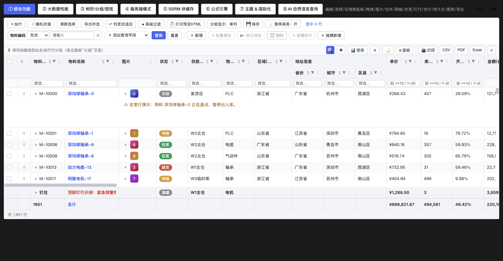
</p>

<h1 align="center">rj-grid</h1>

<p align="center">
  <b>An enterprise-grade Vue 3 data grid with zero third-party dependencies — every AG Grid feature, MIT licensed, ~110 KB gzip.</b><br/>
  Virtual scrolling · pinned columns · grouping & pivoting · tree · undoable editing · formula engine · SSRM server-side row model · theming & i18n · print/CSV/Excel/PDF · offline natural-language query (NLQ)
</p>

<p align="center">
  <a href="https://www.npmjs.com/package/rj-grid"></a>
  <a href="https://github.com/rjding/rjGrid"></a>
  <a href="https://gitee.com/rjding/rj-grid"></a>
  <a href="https://github.com/rjding/rjGrid/blob/master/LICENSE"></a>
  <a href="https://gitee.com/rjding/rj-grid"></a>
  
  <a href="https://vuejs.org/"></a>
  
  
</p>

<p align="center">
  <a href="#-quick-start">Quick Start</a> ·
  <a href="#-feature-showcase">Showcase</a> ·
  <a href="#-vs-ag-grid">vs AG Grid</a> ·
  <a href="docs/RjGrid_Manual_EN.md">Full Manual</a> ·
  <a href="https://github.com/rjding/rjGrid">GitHub</a> ·
  <a href="https://gitee.com/rjding/rj-grid">Gitee</a> ·
  <a href="https://gitee.com/rjding/rj-grid">中文</a>
</p>

---

## 💡 Why rj-grid

Picture this: a single `<rj-grid>` tag that replaces those tables in your project that freeze past a few tens of thousands of rows, and that force you to swap libraries the moment you need grouping — all **without pulling in any third-party dependency** and without paying a license fee to a commercial grid vendor.

- **Truly zero-dependency**: the only runtime requirement is `vue`; even the optional charting is lazily `import('echarts')`. Nothing is bundled, nothing pollutes your lockfile.
- **Absurdly small**: ~110 KB gzip, yet it packs the combined feature set of several other libraries.
- **Silky at 100k rows**: two-way row/column virtual scrolling; 100,000 rows × 12 columns open instantly in practice (generation takes only ~12 ms).
- **AG Grid-parity features**: tree / grouping / pivoting / SSRM / formulas / theming / i18n / export / NLQ — all included.
- **Native TypeScript**: full type inference and `.d.ts`; editor autocompletion throughout — not a rough "make it work first" job.
- **Free for commercial use**: MIT license, safe for individuals and companies alike.

---

## ✨ Feature overview

| Category | What you get |
|---|---|
| Rendering | Row/column virtual scrolling (smooth at 100k rows), pinned columns, multi-level headers, three density levels, pinned rows, full-width rows; **single-click a cell to select its row** (`selectOnCellClick`, no checkbox needed) |
| Data | Four modes: client-side / pagination / infinite scroll / **SSRM server-side row model** (block cache on demand) |
| Grouping | Tree of arbitrary depth, drag-to-group, multi-level grouping + group footers, column pivoting (with a high-cardinality guardrail) |
| Editing | 8 editor types, validation, undo/redo, batched transaction back-fill, built-in add/edit row dialog |
| Formulas | Zero-dependency Excel-style formulas: `=B2*C2`, `SUM/COUNTIF/SUMIF`, range references, circular-reference detection |
| Filtering | Header funnel / floating filter row / quick search / advanced filter (cross-column AND/OR expression tree) — four layers stackable |
| Appearance | Theme engine (4 presets × light/dark × accent color × custom CSS variables), i18n (zh/en + text override), icon replacement |
| Output | Print / CSV / Excel / PDF, with three scopes: selected rows / current view / backend export; the four buttons can each be shown/hidden (`showPrint`/`showCsv`/`showPdf`/`showExcel`) |
| Extensibility | Declare `actions` on a column for bordered cell buttons (overflowing ones fold into a "⋯" menu); declare `contextMenus` on the grid for a custom right-click menu (submenus / confirm / danger items) — both are plain declarative arrays; right-clicking a row also ships a built-in "View Row JSON" themed dialog with zero host wiring |
| AI | Purely offline deterministic **NLQ**, bilingual and following i18n: Chinese like `数量大于50 按单价降序`, English like `qty > 50 sort by price desc`, with the readback matching the language |
| State | `stateKey` auto-persistence + programmatic `getState/setState`; your view survives a refresh |

---

## 🚀 Quick Start

> Three steps, two minutes, running.

**① Install**

```bash
npm install rj-grid
# or pnpm add rj-grid / yarn add rj-grid
```

**② Import the component and styles**

```ts
// main.ts —— importing the stylesheet once globally is enough
import 'rj-grid/style.css'
```

**③ Use it directly**

```vue
<template>
  <rj-grid :columns="cols" :rows="rows" row-key="id" :height="480" show-toolbar />
</template>

<script setup lang="ts">
import { RjGrid } from 'rj-grid'        // ⚠️ must be a VALUE import, not `type` only
import type { RjColumn, RjRowData } from 'rj-grid'

const cols: RjColumn[] = [
  { field: 'name',  title: 'Name',  width: 160, filter: 'text' },
  { field: 'qty',   title: 'Qty',   type: 'num',   aggFunc: 'sum' },
  { field: 'price', title: 'Price', type: 'money', aggFunc: 'avg' }
]
const rows: RjRowData[] = [
  { id: 1, name: 'Bearing', qty: 100, price: 12.5 },
  { id: 2, name: 'Motor',   qty: 30,  price: 480 }
]
</script>
```

Turn on `show-toolbar` and you instantly get pinned columns, grouping, filtering, export and column visibility — without writing another line of code. Want more? Just add a prop — full parameters for every feature are in the [📖 Manual](docs/RjGrid_Manual_EN.md).

---

## 🎬 Feature showcase

Real product screenshots/GIFs, all captured from the `playground` demo page:

<table>
  <tr>
    <td width="50%">
      <b>🎨 Theme engine · 4 presets × light/dark × multi-language</b><br/>
      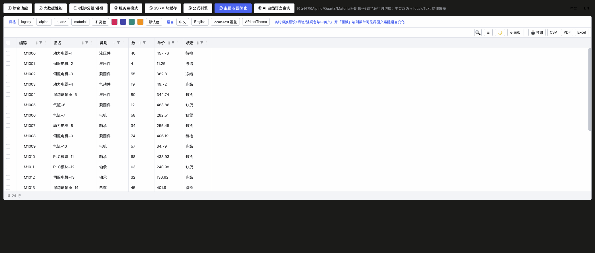
    </td>
    <td width="50%">
      <b>🤖 Offline natural-language query (NLQ)</b><br/>
      Type a sentence; it applies filter + sort + grouping automatically.<br/>
      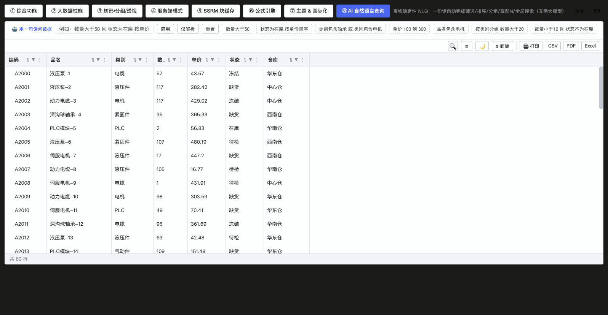
    </td>
  </tr>
  <tr>
    <td>
      <b>🌲 Tree hierarchy · expand / collapse in one click</b><br/>
      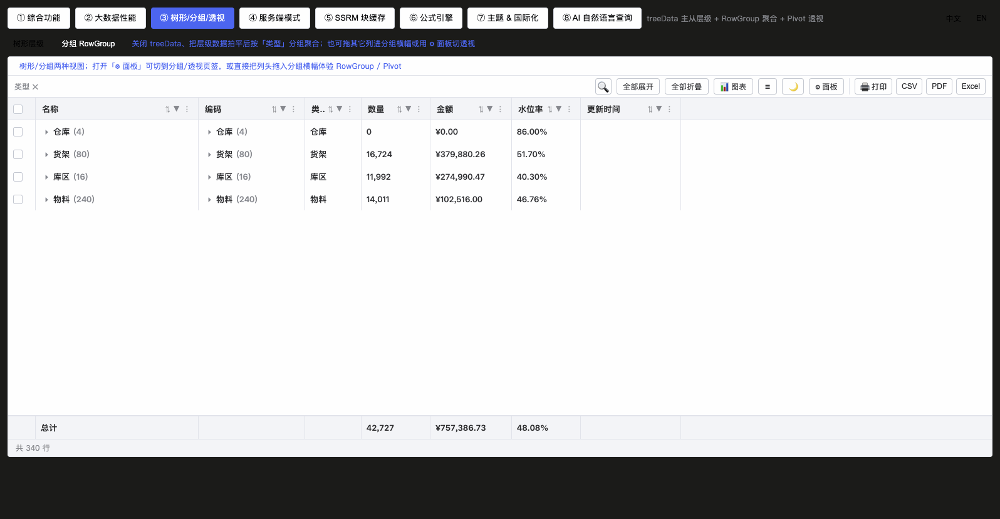
    </td>
    <td>
      <b>🔍 Quick filter · instant cross-column match highlighting</b><br/>
      
    </td>
  </tr>
  <tr>
    <td>
      <b>🧮 Formula engine · Excel-style, zero dependency</b><br/>
      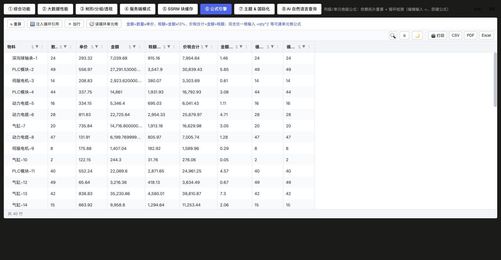
    </td>
    <td>
      <b>📦 Built-in row edit / add dialog · form generated from column defs</b><br/>
      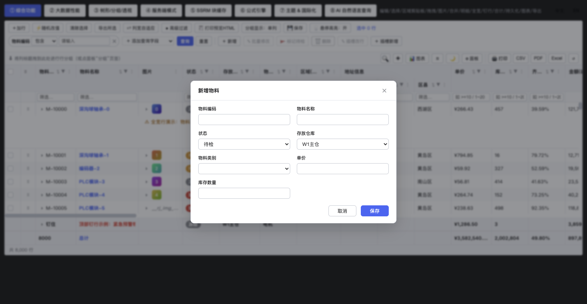
    </td>
  </tr>
  <tr>
    <td>
      <b>📊 Group aggregation + footers</b><br/>
      
    </td>
    <td>
      <b>⚡ 100k-row virtual scrolling · generation takes only ~12 ms</b><br/>
      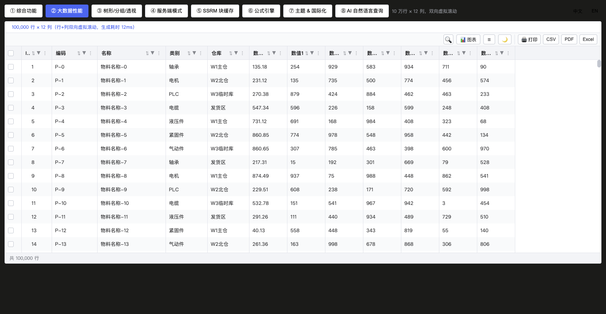
    </td>
  </tr>
  <tr>
    <td>
      <b>↕️ Row drag · drag the handle to reorder rows</b><br/>
      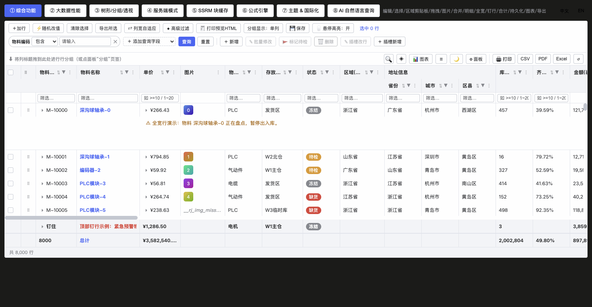
    </td>
    <td>
      <b>⇄ Column drag · drag in the column menu's "Columns" tab to reorder (order changes live)</b><br/>
      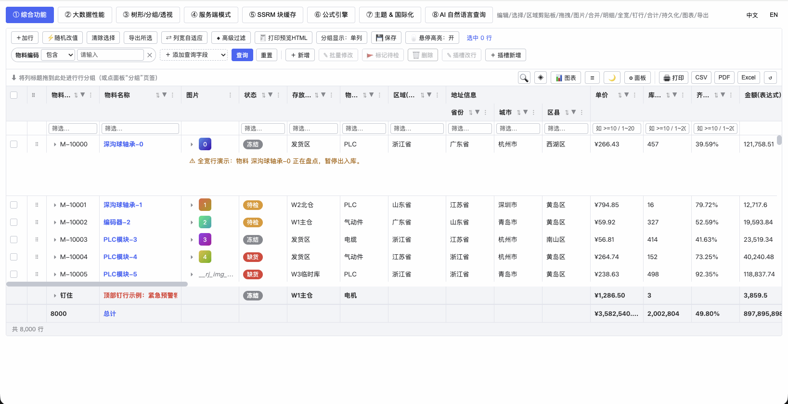
    </td>
  </tr>
  <tr>
    <td colspan="2">
      <b>➕ Dynamic query fields · get a configurable query bar with a single `queryable` prop</b><br/>
      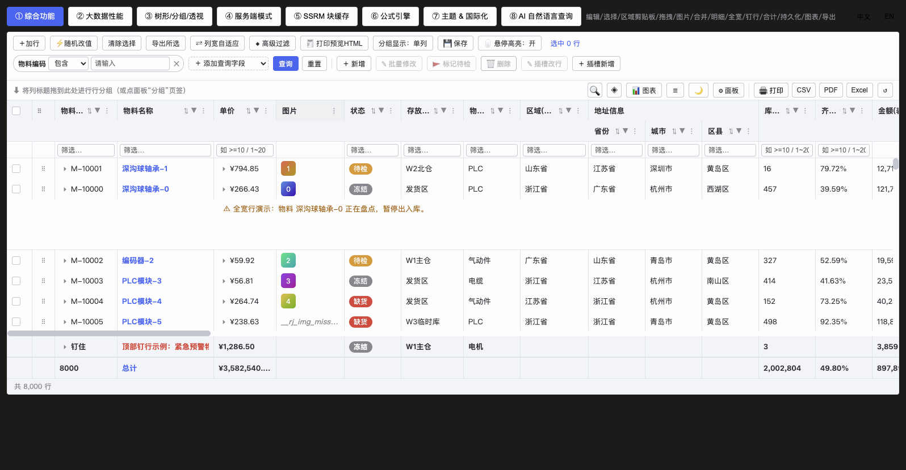
    </td>
  </tr>
  <tr>
    <td width="50%">
      <b>🔎 Server-side query + pagination · condition bar and pager on one row</b><br/>
      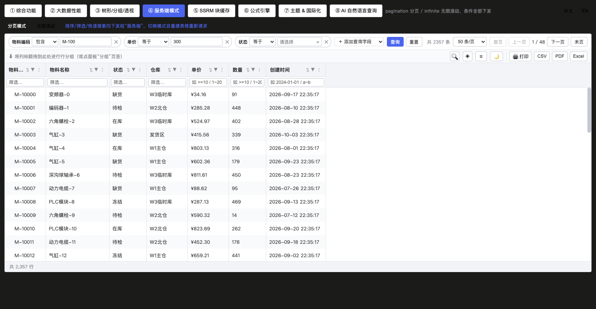
    </td>
    <td width="50%">
      <b>☰ Three density levels · fit more on screen or go roomy and readable, switch freely</b><br/>
      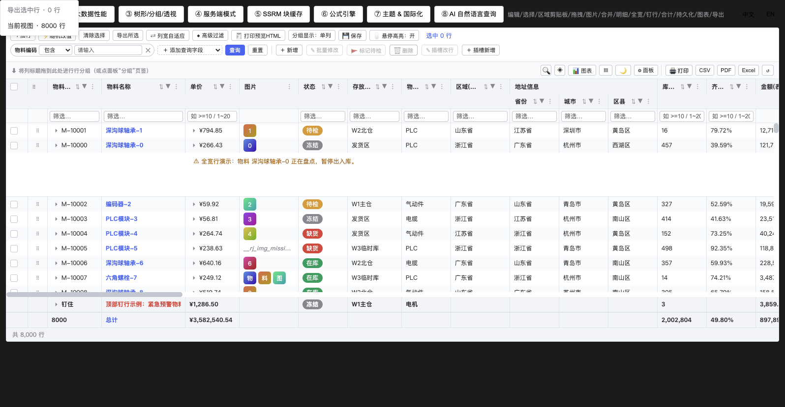
    </td>
  </tr>
  <tr>
    <td width="50%">
      <b>💾 Save view · snapshot the current query/column layout/sorting in one click</b><br/>
      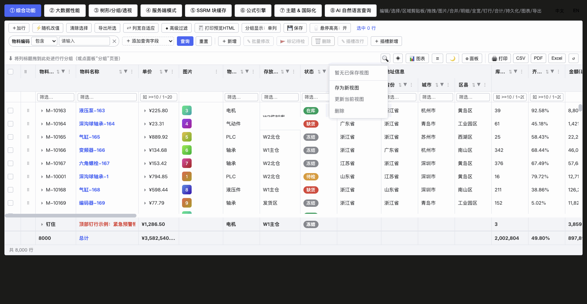
    </td>
    <td width="50%">
      <b>▦ Tool panel · manage column visibility / grouping / pivoting by drag</b><br/>
      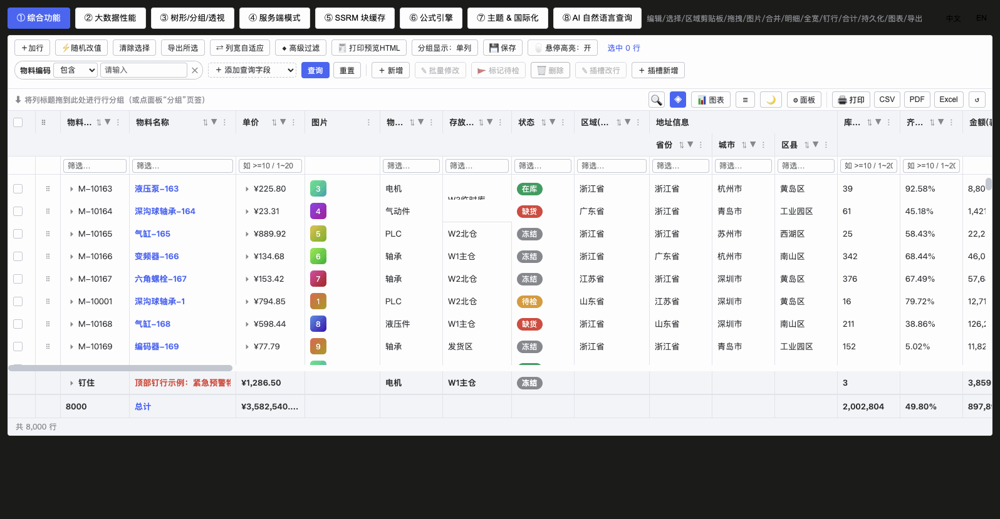
    </td>
  </tr>
  <tr>
    <td colspan="2">
      <b>🖨 Print / export · front-end (selected rows / current view) + backend export, three scopes</b><br/>
      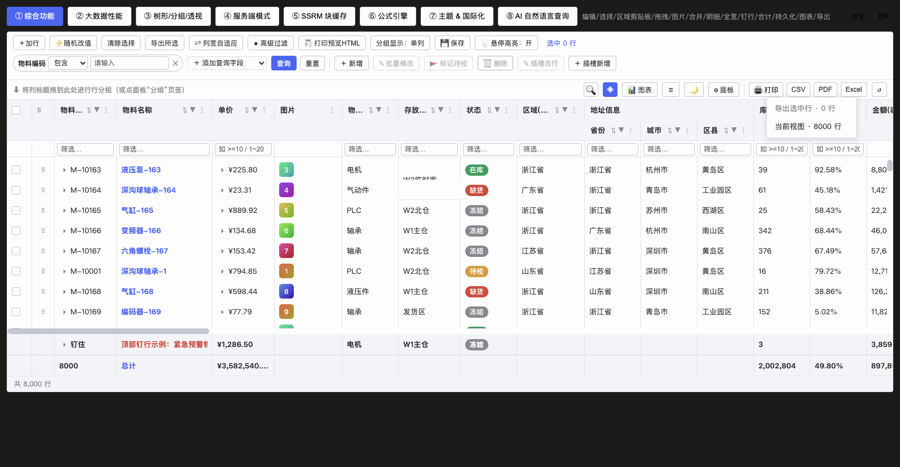
    </td>
  </tr>
</table>

---

## 🖱️ Two-line extensions: cell buttons + custom context menu

No slots, no renderers — one declarative array is enough (full parameters in the [📖 manual](docs/RjGrid_Manual_EN.md)).

**① Cell buttons (`col.actions`)**: bordered buttons rendered right inside the cell; anything exceeding the column width folds into a "⋯" dropdown. `disabled` / `visible` / `confirm` can be evaluated per row:

```ts
const cols: RjColumn[] = [
  // ...
  {
    field: 'op', title: 'Actions', width: 120, fixed: 'right',
    actions: [
      { name: 'edit', label: 'Edit', icon: '✎', onClick: (p) => openEdit(p.row) },
      { name: 'del', label: 'Delete', danger: true,
        confirm: (p) => `Delete ${p.row.name}?`,        // built-in confirm dialog
        visible: (p) => p.row.status !== 'LOCKED',      // per-row visibility
        onClick: (p) => remove(p.row) }
    ]
  }
]
```

**② Custom context menu (`contextMenus`, v0.3.0+)**: a declarative array in the same spirit as actions, appended after the built-in items (copy / edit / select row). Declaring it turns the context menu on by itself — no `contextMenu` prop needed:

```vue
<rj-grid :columns="cols" :rows="rows" :context-menus="contextMenus" />
```

```ts
import type { RjContextMenuItem } from 'rj-grid'

const contextMenus: RjContextMenuItem[] = [
  { name: 'copyCode', icon: '⧉', label: 'Copy Code', visible: (c) => !!c.row?.code,
    onClick: (c) => navigator.clipboard?.writeText(String(c.row.code)) },
  { name: 'tools', label: 'More Tools', children: [              // one-level submenu, opens on hover
      { name: 'audit', label: 'Audit Log', onClick: (c) => audit(c.rowIndex) }
  ]},
  { name: 'del',   icon: '🗑', label: 'Delete Row', danger: true,  // red danger item
    visible: (c) => !!c.row,                                      // hidden over blank area / group rows
    confirm: 'Delete this row?',
    onClick: (c) => c.api?.applyTransaction({ remove: [c.row] }) }
]
```

The callback context `c` carries `{ row, column, colId, rowIndex, value, api, event }`; every click also emits the `@context-menu-action` event (with `item`), so you can listen once at grid level without wiring `onClick`. The legacy `contextMenu` function prop stays compatible and the two can coexist.

**③ Built-in row JSON viewer (`rowJson`, v0.3.3+)**: the right-click menu ships a built-in "View Row JSON" item (appears whenever a data row is hit, no configuration at all), opening a themed built-in dialog: pretty-printed JSON, selectable text, one-click copy, mask/Close to dismiss — circular references and other dirty data degrade gracefully instead of throwing. Turn it off with `:row-json="false"` if unwanted:

```vue
<!-- On by default: right-click a row → "View Row JSON" → themed dialog (follows light/dark automatically) -->
<rj-grid :columns="cols" :rows="rows" row-key="id" :context-menu="true" />

<!-- Don't want the built-in item -->
<rj-grid :columns="cols" :rows="rows" row-key="id" :row-json="false" />
```

**④ Right-click never blocks copy/paste (v0.3.4+)**: the grid menu only takes over plain right-clicks on rows. Right-clicks on blank areas outside rows, inside editors/filter inputs, and **after selecting text** all fall through to the native browser menu — select a value in a cell, copy it, and paste it into a filter box or query bar with zero interference.

---

## 🔍 vs AG Grid

| Aspect | rj-grid | AG Grid |
|---|---|---|
| License / cost | ✅ MIT, completely free | ⚠️ enterprise features need a commercial license |
| Third-party runtime deps | ✅ `vue` only | ⚠️ ships its own framework and module system |
| gzip size | ✅ ~110 KB | considerably larger |
| Native Vue 3 | ✅ value-import and use, not a wrapper | provides a Vue wrapper layer |
| Offline natural-language query | ✅ built-in deterministic NLQ | ❌ none |
| Virtual scroll / grouping / pivot / SSRM / formulas / theming / export | ✅ all built in | ✅ some behind the paid tier |

> rj-grid is not positioned as an "AG Grid clone" — it's a **free, lightweight, batteries-included**, high-quality option for Vue projects.

---

## 🧩 Data modes (pick as needed)

```vue
<!-- Client-side: load everything into rows; sorting/filtering/grouping all run in the browser, virtual scrolling handles 100k rows -->
<rj-grid :columns="cols" :rows="rows" row-key="id" />

<!-- Pagination: backend-paged, loadData automatically carries sorting/filters/page number; pager position is set by pager-position -->
<rj-grid :columns="cols" data-mode="pagination" :load-data="loadData" :page-size="20" />

<!-- Infinite scroll: fetch the next block when scrolling to the bottom, no page numbers -->
<rj-grid :columns="cols" data-mode="infinite" :load-data="loadData" />

<!-- SSRM server-side row model: grouping / big-data block cache, load blocks on demand -->
<rj-grid :columns="cols" data-mode="serverSide" :load-data="loadData" server-side-grouping />
```

```ts
import type { RjLoadServerParams } from 'rj-grid'
// params automatically include start/end/page/pageSize/sort/filters/quickFilterText/rowGroup… — pass them straight to the backend
async function loadData(p: RjLoadServerParams) {
  const res = await api.queryPage(p)
  return { rows: res.list, total: res.total, success: true }
}
```

Full configuration and callback signatures for each mode are in [Manual §6 Data modes](docs/RjGrid_Manual_EN.md).

---

## 🛠 Compatibility & tech stack

- **Framework**: Vue `^3.4.0` (the only required peer dependency)
- **Optional**: `echarts >= 5.0.0` (used only by the "integrated chart" dialog; degrades gracefully when not installed, without crashing the page)
- **Language**: fully typed TypeScript, `.d.ts` shipped with the package
- **Styles**: a single `rj-grid/style.css`; theming via CSS variables, overridable as needed
- **Build**: Vite library mode, single ESM file, `sideEffects` limited to CSS, tree-shaking friendly

---

## 🖥 Run the demo page locally

The demo page (`playground/`) starts its own server and doesn't depend on a host project; the 8 tabs are your feature map:

```bash
git clone https://github.com/rjding/rjGrid.git   # in mainland China you can use the mirror: git clone https://gitee.com/rjding/rj-grid.git
cd rjGrid
pnpm install
pnpm dev          # defaults to http://localhost:5173
```

> ① Full features ② Big-data performance ③ Tree/grouping/pivot ④ Server-side modes ⑤ SSRM block cache ⑥ Formula engine ⑦ Theming & i18n ⑧ AI natural-language query

---

<details>
<summary><b>📚 Maintainer info (repo layout / dev commands / release discipline)</b></summary>

### Repository structure

| Path | Purpose |
|---|---|
| `index.ts` | Package entry (value-exports `RjGrid` + the NLQ / query-condition kernel + all public types) |
| `src/` | Component and engine source (`src/types.ts` is the type authority) |
| `__tests__/` | 407 unit-test cases, entry `__tests__/run.ts` |
| `build/rjDistCheck.mjs` | Five dist health-check guards (run automatically at the end of a build) |
| `vite.lib.config.ts` | Library build: single ESM file + single `style.css`, external `vue`/`echarts`, no sourcemap |
| `playground/` | 8-tab demo page |
| `docs/RjGrid_Manual_EN.md` | Full manual (features, API, pitfalls and boundaries) |
| `dist/` | Release artifacts, committed alongside the library |

### Development commands

```bash
pnpm test      # unit tests, 407 passed
pnpm ts        # vue-tsc --noEmit
pnpm lint      # eslint + stylelint
pnpm build     # vite lib → vue-tsc d.ts → five dist health-check guards
pnpm size      # bundle size report
pnpm dev       # playground demo page
```

### Releasing a new version

Edit the source → `npm version patch|minor|major` (auto bump + commit + tag) → `git push --follow-tags` → `npm publish` (`prepublishOnly` automatically runs `pnpm build && pnpm test`, so a stale dist can never be published).

### Host-integration notes

- When installed from npm the directory name is standardized (`node_modules/rj-grid`), so styles can be imported directly with `import 'rj-grid/style.css'`.
- On the component side you must **value-import** `import { RjGrid } from 'rj-grid'`; a type-only import throws `Failed to resolve component: rj-grid` at runtime.
- When installing via a git URL, pnpm places the dependency in a directory whose name contains `#<commit>`; vite resource URLs with a bare `#` are treated as a fragment and dropped → 404 under dev, so use a CSS `@import` shim in that case (see Manual §15.4).
- Committing `dist` only exists to support the git-URL install path; `sourcemap: false` is source protection, not an option, and the five dist guards keep it in check at the same time.

</details>

---

## 🤝 Contributing

Issues and PRs are welcome: report bugs, request features, improve docs. Please include relevant unit tests with your change and keep `pnpm test && pnpm ts && pnpm lint && pnpm build` all green.

## 📄 License

[MIT](LICENSE) — free for individuals and companies to use, modify and redistribute.

## ☕ Support the author

If rj-grid has helped you, consider dropping a ⭐ Star, or buying the author a coffee:

<p align="center">
  
</p>
