# RjGrid Manual

> [中文手册](https://gitee.com/rjding/rj-grid/blob/master/docs/RjGrid使用手册.md) · [README](https://gitee.com/rjding/rj-grid)

> A self-developed, zero-dependency enterprise data grid, built to AG Grid's feature spec. Implemented in Vue 3 / TypeScript, ~110 KB gzip (excluding the vue / echarts external dependencies).
> Component source: `src/` in this repository (standalone repo `rjGrid`, remote https://github.com/rjding/rjGrid.git) · Demo page: `playground/` (start the server with `pnpm dev`)

---

## 1. Overview

> The image below is the overall result of the "Full features" demo tab: multi-level headers, pinned columns, image/badge/sparkline cells, pinned rows, a summary row and full-width rows shown all at once.


| Domain | Highlights |
|---|---|
| Rendering | Virtual scrolling (rows + columns), smooth at 100k rows; three density levels; pinned columns / multi-level headers |
| Data modes | client / infinite / pagination / serverSide (SSRM block cache + server-side grouping) |
| Row model | sorting, filtering, quick/floating/advanced filter, row grouping, tree, pivot, summary row, pinned rows, master-detail, full-width rows |
| Editing | 8 editor types, validation, undo/redo, dirty-cell markers, paste transformation, formula engine |
| Selection | single/multi select, select-all in header, cascading group selection, cross-page retention, range selection, clipboard copy/paste |
| Interaction | column drag reorder (header drag / column-menu "Columns" tab drag / tool-panel drag — three entry points), column resize, row drag (the whole handle column is the grab area, AG-style full animation), context menu, column menu, tool panel, status-bar aggregation |
| Output | four toolbar buttons print / CSV / PDF / Excel(xlsx), all zero-dependency (PDF goes through the browser's Save-As); clicking any button pops up a scope choice (export selected rows / current view / backend export by query conditions) |
| Pagination | the `pagination` mode ships its own pager, position configurable via `pagerPosition` (default **top-right of the toolbar, on the same row as the query**, so you can page without scrolling down after a query; options bottom = a dedicated row below the body / both); the full `client` mode shows no pager |
| Appearance | theme engine (4 presets × light/dark × accent color × custom variables), i18n (zh/en + text override), icon replacement |
| State | `stateKey` auto-persistence + programmatic `getState/setState` |
| AI | purely offline deterministic NLQ: Chinese natural language → filter/sort/group/search/top-N |

## 2. Quick Start

```vue
<template>
  <rj-grid :columns="cols" :rows="rows" row-key="id" :height="480" show-toolbar />
</template>

<script setup lang="ts">
import { RjGrid } from 'rj-grid'
import type { RjColumn, RjRowData } from 'rj-grid'

const cols: RjColumn[] = [
  { field: 'name', title: 'Name', width: 160, filter: 'text' },
  { field: 'qty', title: 'Qty', type: 'num', aggFunc: 'sum' },
  { field: 'price', title: 'Price', type: 'money', aggFunc: 'avg' }
]
const rows: RjRowData[] = [
  { id: 1, name: 'Bearing', qty: 100, price: 12.5 },
  { id: 2, name: 'Motor', qty: 30, price: 480 }
]
</script>
```

- The package is an ordinary npm dependency: to use `<rj-grid>` in a template you must **value-import** `import { RjGrid } from 'rj-grid'` inside `script setup` (the host's own auto-registration table has no such component; a type-only import throws `Failed to resolve component: rj-grid` at runtime), and import the stylesheet explicitly (through the host's `src/styles/rjgrid/index.css` shim — see §15.4 for why). The demo page in this repo's `playground/` follows exactly this pattern.
- The `rj-grid` entry also exports: `parseNLQ` / `explainNLQ` (NLQ), `deriveQueryFields` / `queryOpsOfKind` / `defaultQueryOperator` / `activeQueryConditions` / `rowPassesQuery` / `matchQueryValue` / `kindOfColumn` (the shared kernel behind the query-condition bar), `buildFormFields` / `applyFormChanges` / `normalizeEditor` / `formFieldKind` / `queryActionDisabled` / `queryActionConfirm` (the shared kernel behind the row-edit dialog), plus all public types (`RjColumn` / `RjGridApi` / `RjGridState` / `RjFilterModel` / `RjPrintParams` / `RjServerExportParams` / `RjQueryFieldDef` / `RjQueryAction` / `RjRowFormConfig` / `RjSavedView` / `RjMenuContext` / `RjThemeParams` / `RjIconsOverride` …).
- **Always set `row-key`** (the unique row field); selection, persistence, transactions and dragging all depend on it.

## 3. Props reference

### 3.1 Basics

| Prop | Type | Default | Description |
|---|---|---|---|
| `columns` | `RjColumn[]` | required | column definitions (see §4) |
| `rows` | `RjRowData[]` | `[]` | row data (client/infinite/pagination modes) |
| `rowKey` | `string` | — | unique row-key field, strongly recommended |
| `height` | `number \| '100%'` | `'100%'` | grid height |
| `loading` | `boolean` | — | loading overlay (customizable via the `#loading` slot) |
| `density` | `'small'\|'medium'\|'large'` | `'medium'` | **three density levels (small/medium/large)**: body row height / font size and the **entire UI scale** (toolbar / second-row buttons, inputs, pager, query chips) scale proportionally; the density button on the second row cycles through them, its title shows the current level |
| `dataMode` | `'client'\|'infinite'\|'pagination'\|'serverSide'` | `'client'` | data mode (see §6) |
| `ariaLabel` | `string` | `''` | accessibility label |

### 3.2 Feature switches

| Prop | Default | Description |
|---|---|---|
| `showToolbar` | `true` | **two-row toolbar (feature-button block swaps with the pager)**: **row one** holds slots and the query-condition bar (left-aligned) on the left, and the pager on the right (when `pagerPosition` includes top/both); **row two** (`.rj-second-bar`, i.e. the row where the pager was inlined previously) has the "drag column headers here to group rows" banner on the left (when `groupable && showGroupPanel`), and the **feature-button block** on the right, in order: 🔍 quick search, ◈ views, expand/collapse all, chart, density, theme, panel, export group, reset (each shown/hidden per its switch) |
| `quickFilterEnabled` | `true` | quick search: the **🔍 button** in the second-row feature block; clicking opens an input in the same family of popup as export (opens downward by default, upward only when there's no room below; cross-column contains match; instant filtering in `client` mode, surfaced with data fetch in server modes) |
| `floatingFilters` | `false` | floating filter row under the header (a live input per column, supports `>=10`, `1~20` syntax) |
| `rowSelection` | `false` | `false`/`'single'`/`'multiple'`, auto-prepends a 44px checkbox column |
| `selectOnCellClick` | `true` | **single-click a data-row cell to select that row** (replace-style, so delete/edit buttons can grab the selected row without ticking the checkbox first); holding `Ctrl`/`Shift`/`Alt` still does range selection, checkboxes keep multi-select, double-click still edits; set `false` to restore the old behavior |
| `keepSelectionCrossPage` | — | keep selected rows across paging / data reload |
| `editable` | `false` | allow cell editing (fine-grained per column via `editable`) |
| `rangeSelection` | `true` | drag-select a rectangular range with the mouse (Shift to extend) |
| `clipboard` | `true` | Ctrl+C/X/V copy/cut/paste |
| `copyHeadersToClipboard` | `false` | include the header row when copying |
| `pasteTransformer` | — | pre-paste text transform hook `(text) => text` |
| `contextMenu` | `false` | `true` for the default menu, or `(ctx: RjMenuContext) => RjMenuItem[]` for a custom one |
| `contextMenus` | `-` | Declarative custom context-menu items (`RjContextMenuItem[]`, or a function returning them per context), appended after the built-in items; declaring it turns the context menu on by itself (v0.3.0+) |
| `rowJson` | `true` | Built-in "View Row JSON" context-menu item (shown when a data row is hit), with a themed dialog: pretty-printed JSON, one-click copy, circular refs degrade automatically; `:row-json="false"` turns it off (v0.3.3+) |
| `rowDraggable` | `false` | row drag reorder (auto-prepends an ~34px handle column, **the whole column is the grab area**, full animation). **Available in `client` / `pagination` / `infinite` modes** (in `serverSide` the row order belongs to the block cache and the backend, so **no handle column is injected**), and only when there is currently no sorting / row grouping / pivot / tree — otherwise a hint appears and the drag is refused. `client` reorders the component's internal copy of the rows (the host's `rows` array order stays unchanged); `pagination` / `infinite` reorder **the batch already loaded into memory** — see §8.1 (pagination semantics in §8.2) |
| `undoRedoCellEditing` / `undoRedoCellEditingLimit` | `false` / `50` | editing undo/redo (Ctrl+Z / Ctrl+Y) |
| `markDirtyCells` | `false` | dirty-cell corner markers (edited but unsaved), used with `api.isDirty()` for a save workflow |
| `rowHover` | `true` | hover-row highlight (linked across pinned layers) |
| `colReorder` | `true` | header drag to reorder columns (you can also reorder columns by dragging in the column menu's "Columns" tab and in the tool panel; all three entry points go through `moveColumn`; see §8) |
| `resizable` | `true` | column-width drag resize (double-click to auto-fit) |
| `exportable` / `chartable` / `toolPanel` | `true` | export button / chart / column tool panel |
| `showPrint` / `showCsv` / `showPdf` / `showExcel` | `true` | **individual visibility** of the four toolbar **Print / CSV / PDF / Excel** buttons (only effective when `exportable` is true); turn off any subset as needed, and the whole group disappears when all are off |
| `groupable` / `showGroupPanel` | `true` | allow grouping / show the group-drag panel |
| `groupFooter` | `false` | show an aggregation footer row at the bottom of each expanded group |
| `groupDisplayType` | `'singleColumn'` | grouping display: merge the level path into one column / one column per level |
| `groupSelectsChildren` | `true` | a group row's checkbox cascades selection to the data rows under it (the group row itself is not counted in selectedRows) |
| `statusBar` / `statusAggregations` | `true` / `sum,avg,count,min,max` | bottom status bar: row count / selection / range aggregation |
| `queryable` | `false` | **dynamic query-condition bar**: "field + operator + value" conditions **inlined at the top-left of the toolbar** (the former quick-search spot), **preset with 1 query field by default** (the first text column, e.g. code/name), dynamically add/removable; instant front-end filtering in `client` mode, surfaced via `params.queryConditions` of `loadData` in server modes for the host to apply (see §9.10) |
| `queryFields` | `[]` | query-field candidate **override**: if not passed, derived automatically from column defs (skipping internal columns and `filter:false`); if passed, you can add `kind`/`options` for enum columns |
| `queryActions` | `[]` | **custom action buttons next to "reset" in the query bar** (`RjQueryAction[]`: modify/delete…): the disabled state is evaluated live against selected rows, `confirm` goes through the built-in confirm dialog, the callback receives selected rows + api + `openRowForm`; there is also a `#query-actions` override slot track (see §9.11) |
| `rowForm` | `true` | **built-in row edit/add dialog**: the form is generated from column defs; edit with single selection pre-fills everything, multi-selection diffs for batch, add shows a blank form (`openRowFormAdd`); `false` disables the feature, `RjRowFormConfig` can configure `title/width/columns` and `addTitle/addColumns` gating (see §9.11) |
| `viewable` | `false` | **custom views**: collapsed into a **◈ button** in the second-row feature block (not a dedicated row); clicking opens the view menu: switch view / save as new view / update current view / delete; the snapshot covers "query fields + conditions + column layout + sorting/grouping", stored in localStorage (relies on `stateKey` for isolation; see §9.10) |
| `builtinViews` | `[]` | built-in views (`RjSavedView[]`, read-only, always listed ahead of user views); user changes go through "save as new view" |

### 3.3 Row-model extensions

| Prop | Default | Description |
|---|---|---|
| `showSummary` | `false` | bottom summary row (aggregates per column `aggFunc`; the label column is auto-chosen, or specify it via `summaryLabel: true` on a column) |
| `pinnedTopRows` / `pinnedBottomRows` | `[]` | top/bottom pinned rows (excluded from selection/drag/sorting) |
| `treeData` | — | tree mode: pair with `childrenField` (nested) or `parentField` (flat parent-child references) |
| `childrenField` / `parentField` | `'children'` / `''` | tree data fields |
| `defaultExpandAll` | `false` | expand all trees/groups initially. **The "expand all / collapse all" buttons only appear when "there is data AND hierarchical display is active (`treeData` or rows are grouped)"**; flat empty tables and non-hierarchical plain lists don't show them by default. Here "has data" is judged against the **filtered dataset** (including group rows / tree rows), so as soon as you drag in a grouping — even with default collapse (leaf rows not yet exposed) — the buttons still appear and you can expand all in one step; after clicking collapse-all the buttons don't disappear either |
| `fullWidthRow` | — | `(row) => boolean` to determine full-width rows; content via the `#full-row` slot |
| `detailHeight` / `fullWidthHeight` | `240` / `90` | master-detail height / full-width row height; detail content via the `#row-detail` slot |
| `getRowClass` | — | `(params) => string` row-level custom class |
| `suppressVirtualCols` | — | disable column virtualization (for special debugging / export scenarios) |

### 3.4 Server-side & pagination

| Prop | Default | Description |
|---|---|---|
| `loadData` | — | `(p: RjLoadServerParams) => Promise<{ list/rows, total, ... }>` server data fetch |
| `pageSize` | `100` | page/block size for pagination/infinite |
| `serverSideGrouping` | `false` | server-authoritative grouping (grouping definitions pushed down to the backend, the client doesn't rebuild the group tree). Effective in non-`client` modes paired with the `rowGroup` dimension: group rows are collapsible and their triangle can be clicked to drill down and fetch child blocks (see §3.4) |
| `ssrmBlockSize` / `ssrmMaxBlocksInCache` / `ssrmCacheOverflow` | `100` / `10` / `4` | SSRM block size / cache block-count limit (0 = unlimited) / blocks retained outside the viewport |
| `isServerSideGroup` | — | `(data) => boolean`: **declares whether a row is a drillable server-side group row**. Returning `false` (or defaulting with no children) means the group row renders no expand triangle and issues no child-block request; for the case where the backend knows "this group has no more child nodes" (see §3.4) |
| `pagerPosition` | `'top'` | pager position `'top'`/`'bottom'`/`'both'`. The pager shows **only** in `pagination` mode when `loadData` is passed; the full `client` mode has no pager. `top` = **top-right of the toolbar, on the same row as the query conditions / query button of row one** (page directly after querying without scrolling down); `bottom` = a dedicated row below the body; `both` shows in both places |

### 3.5 Appearance / state

| Prop | Default | Description |
|---|---|---|
| `theme` | — | `'light'`/`'dark'` or `RjThemeParams` (see §9.7) |
| `detectHostTheme` | `true` | When no explicit theme is set, automatically follow the host `<html>` `dark`/`light` class (outer-framework theme sync); `false` limits `auto` to the OS preference only (see §9.7) |
| `lang` | `'zh'` | `'zh'`/`'en'`/locale tag (normalized internally) |
| `localeText` | — | override built-in texts per key, highest priority |
| `icons` | — | replace UI glyphs by semantic name |
| `stateKey` | — | with a given key, auto-persists view state to localStorage (key prefix `rj-grid-state:`) |
| `exportRange` / `exportFileName` / `exportRawValues` | `'auto'` / — / `false` | default export scope (`auto`/`selected`/`view`/`all`, re-selectable per use via the toolbar menu) / file name / export raw values (numbers stay numeric in Excel) |
| `serverExport` | — | `(p: RjServerExportParams) => void｜Promise<void>`: "backend export" only appears in the export menu when this is passed; the component just passes through the effective columns + query state + pagination snapshot + selected keys — the API call and download are done by the host (see §9.6) |
| `dictLoader` / `optionsLoader` | — | grid-level fetch hooks for the unified options carrier: `dictLoader(key)` serves a column's `dict`/`options:{dict}`, `optionsLoader(name)` serves `options:{ref}`; the same source feeds display/filter/edit/NLQ (see §4.1) |

## 4. Column definition `RjColumn`

```ts
interface RjColumn {
  field?: string          // supports 'a.b.c' paths; when there's no field, pair with valueGetter
  colId?: string          // unique id, defaults to field
  title?: string
  width?: number; minWidth?: number; maxWidth?: number; flex?: number
  fixed?: 'left' | 'right' | false
  hidden?: boolean       // hidden by default; users can still turn it on in the column panel / via `setColumnVisible`
  children?: RjColumn[]   // multi-level headers
  ...
}
```

| Group | Property | Description |
|---|---|---|
| Type | `type` | `'text'\|'num'\|'money'\|'percent'\|'date'\|'datetime'\|'boolean'\|'link'\|'image'`: automatically controls alignment, formatting, editor and filter default forms |
| Value | `valueGetter` / `formatter` / `valueParser` / `filterValueGetter` | all support functions; `valueGetter`/`formatter` also accept a string expression like `'data.price * 100'` |
| Sorting | `sortable` / `initialSort('asc'\|'desc')` / `comparator` / `suppressSort` | click the header to sort, Shift+click for multi-column sorting |
| Filtering | `filter(true\|false\|'text'\|'number'\|'date'\|'select')` / `filterValueMap` | the header-funnel filter panel: text has operators such as equals/contains/starts-with, number supports ranges, select ticks unique values, date ranges |
| Editing | `editable(bool\|fn)` / `editor` | editors see §9.3; `onCellValueChanged` commit hook |
| Formula | `formula: '=qty*price'` / `allowFormula` | a column-level formula evaluated for every row; `allowFormula` lets users type `=SUM(...)` Excel-style formulas (see §9.5) |
| Aggregation | `aggFunc: 'sum'\|'avg'\|'min'\|'max'\|'count'\|'first'\|'last'\|fn` | shared by summary row / group footer / pivot |
| Grouping/pivot | `rowGroup` / `allowPivot` / `initialRowGroup` / `initialPivot` | whether it can be dragged into the group panel / used as a pivot dimension, plus initial state |
| Style | `align` / `headerAlign` / `cellClass(fn)` / `cellStyle(fn)` / `headerClass` / `headerTooltip` / `wrapText` | |
| Render | `cellRenderer(params)` / `headerComponent` / slots `#cell-<colId>` `#header-<colId>` | slots take priority over cellRenderer |
| Actions column | `actions: RjCellAction[]` / `actionsBorder` (default true) / `actionsGap` (default 4) | built-in bordered button group, no slot needed; buttons wider than the column collapse into a "more ⋯" dropdown (see §4.2); `#cell` slot / `cellRenderer` still take priority; summary/pinned synthetic rows render no buttons |
| Span | `colSpan(row)` / `rowSpan(row)` | cell merging; row-spanning cells are auto-raised so the overflow is no longer hidden by the next row's background (v0.3.2+) |
| Special columns | `checkbox: true` checkbox column / `rowDrag: true` drag-handle column | generated automatically by `rowSelection`/`rowDraggable`, usually no need to hand-write |
| Control | `suppressMenu` / `suppressSort` / `suppressExport` | narrow control columns already have `suppressMenu` built in (to avoid overlapping header icons) |
| Image | `image: RjImageConfig` | effective when `type:'image'`: `size/shape/fit/max/lazy/preview/fallback/src`, lazy loading + click for a large preview |
| Sparkline | `sparkline: { style:'bar'\|'line'\|'spider', color?, valueField? }` | micro chart embedded in the cell (self-drawn, zero dependency) |
| Summary | `summaryLabel: true` | explicitly designate the "Total" label for this column |

**Column-definition example (type / formatting / multi-level headers / pinning / image / sparkline / span)**

```ts
import type { RjColumn } from 'rj-grid'

const cols: RjColumn[] = [
  // multi-level header: the parent column only has title + children, only leaf columns carry field
  {
    title: 'Inventory',
    children: [
      { field: 'usedVolume', title: 'Used', type: 'num', width: 90 },
      { field: 'capacityVolume', title: 'Capacity', type: 'num', width: 90 }
    ]
  },
  // a preset type auto-decides alignment + formatting + editor/filter form; formatter can override display
  { field: 'amount', title: 'Amount', type: 'money', formatter: (p) => `$${(p.value).toFixed(2)}` },
  { field: 'rate', title: 'Attainment', type: 'percent' },
  { field: 'inDate', title: 'Inbound date', type: 'date', width: 110 },
  // valueGetter supports a function or a string expression ('data.a.b' paths work too)
  { field: 'full', title: 'Full name', valueGetter: 'data.code + " - " + data.name', filter: 'text' },
  // a computed value that participates in filtering but not in editing: filterValueGetter
  { field: 'statusText', title: 'Status', valueGetter: (r) => (r.status === 0 ? 'Enabled' : 'Disabled'),
    filter: 'select', filterValueMap: { 0: 'Enabled', 1: 'Disabled' } },
  // built-in actions column: declare `actions` and the component renders bordered buttons; overflow collapses into "more ⋯" (see §4.2)
  { field: 'op', title: 'Actions', fixed: 'right', width: 160, sortable: false, suppressMenu: true,
    suppressSort: true, suppressExport: true,
    actions: [
      { name: 'edit', label: 'Edit', icon: '✎', onClick: (p) => edit(p.row) },
      { name: 'del', label: 'Delete', danger: true, confirm: 'Delete this row?', onClick: (p) => del(p.row) }
    ] } as any,
  // image column: lazy-loaded thumbnail + click for a large preview
  { field: 'imgs', title: 'Attachments', type: 'image',
    image: { size: 32, shape: 'rounded', max: 2, fallback: '—', preview: true } },
  // sparkline (self-drawn, zero dependency; valueField reads a number[])
  { field: 'trend', title: 'Last 7 days', sparkline: { style: 'bar', color: '#2f6fed', valueField: 'trend7' } },
  // cell merging + auto line wrap
  { field: 'memo', title: 'Notes', flex: 1, wrapText: true, colSpan: (row) => (row.merged ? 2 : 1) },
  // hidden by default (users can still open it in the column panel, see §14.11)
  { field: 'creator', title: 'Created by', hidden: true }
]
```

### 4.1 Unified options carrier `options` / `dict`

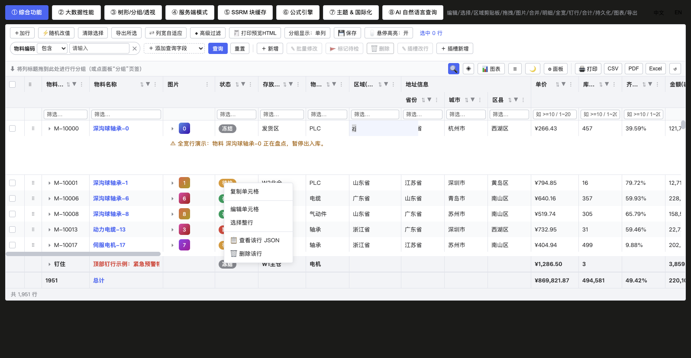

Dropdown/dictionary columns used to require writing the same "value→label" mapping three times (`editor.options` for editing, `formatter` for display, `filterValueMap` for filter labels), and async dictionaries also required hand-writing "fetch → flatten → back-fill `col.editor.options`". Now a column declares **a single data source**, loaded asynchronously by the grid, cached per source, and **fed from one source to all four consumers: display / select filter / select editor / NLQ**.

```ts
import type { RjColumn, RjOptionSource } from 'rj-grid'

const cols: RjColumn[] = [
  // ① static array of candidates
  { field: 'category', title: 'Category', filter: 'select', editor: { type: 'select' },
    options: [{ label: 'Bearing', value: 'B' }, { label: 'Motor', value: 'M' }] },
  // ② factory / async function (resolved only once per function reference, cached grid-wide)
  { field: 'owner', title: 'Owner', filter: 'select', editor: { type: 'select' },
    options: async () => (await fetchUsers()).map((u) => ({ label: u.name, value: u.id })) },
  // ③ object form: goes through the grid-level dictLoader to fetch candidates by dictionary key (col.dict is sugar for it)
  { field: 'status', title: 'Status', filter: 'select', editor: { type: 'select' }, dict: 'mes_status' },
  // ④ object form: goes through the grid-level optionsLoader(ref) to fetch the raw API array, field normalization handled by labelKey/valueKey/map
  { field: 'typeId', title: 'Material type', filter: 'select', editor: { type: 'select' },
    options: { ref: 'typeTree', labelKey: 'name', valueKey: 'id', childrenKey: 'children' } },
  // ⑤ hand over the API function directly (the host doesn't need to flatten and back-fill externally first)
  { field: 'unit', title: 'Unit', filter: 'select', editor: { type: 'select' },
    options: { load: () => fetchUnitList(), map: (u) => ({ label: u.unitName, value: u.unitCode }) } }
]
```

**`RjOptionSource` forms**: `RjEditorOption[]` (static) | `(row?) => RjEditorOption[] | Promise<...>` (factory/async) | object `{ items | load | ref | dict, map?, labelKey?, valueKey?, childrenKey? }`.
- `labelKey`/`valueKey`: by default the label is taken from `label`/`name`/`text` and the value from `value`/`id`/`code`/`key`;
- when `childrenKey` (default `'children'`) hits an array it is **kept as a `children` tree** (no longer flattened): the dropdown renders by hierarchy indentation and is collapsible; the value→label map used for display is **automatically depth-first flattened**, so parent/child nodes both resolve raw value→label, and `label` still uses the node's original name (no indentation added);
- `map` fully customizes the mapping, taking priority over field inference.

**Tree dropdown + search**: any candidates that carry `children` (a tree hit via `childrenKey`, or a `{label,value,children}[]` handed in directly by the host) are shown with hierarchical indentation in both the **select cell editor** and the **query-condition-bar dropdown**, with parent nodes collapsible/expandable via the arrow; both dropdowns have a built-in **search box** (the editor filters as you type, the query-bar panel has a search at its top), and matched nodes automatically keep their ancestor path. Purely flat candidates (no `children`) behave as before, just without the indentation layer.

**Grid-level loaders (Props, optional, if empty ref/dict resolution is disabled)**:

```vue
<rj-grid
  :columns="cols"
  :dict-loader="(key) => getDictOptions(key)"        // a column's dict:'x' / options:{dict:'x'} → returns {label,value}[] or a raw array (can be async)
  :options-loader="(name) => sourceMap[name]"         // a column's options:{ref:'name'} → returns the raw API array (can be async), field normalization handled by labelKey/valueKey/map on the column
/>
```

**Caching**: merged by data-source identity — the same `dict` key / `ref` name / `load`/factory function reference (WeakMap) is resolved **only once** globally; two columns sharing the same dictionary trigger the loader only once; static arrays are cached per column id.

**Backward compatibility (hard constraint)**:
- columns that don't declare `options`/`dict` behave **exactly the same** as before;
- an explicit `col.formatter`, `editor.options` (non-empty), `filterValueMap` **always take priority**; the new carrier only fills in where they are **absent** — i.e. "use it if present, otherwise keep as-is";
- before the async result is back-filled, each consumer falls back to the original behavior (displaying the raw value), and corrects reactively once loaded;
- the grid never mutates or writes back the column objects passed in by the host (no side effects).

**Host migration before/after** (a typical WMS material table, dropping the three-piece set + hand-written async back-fill):

```ts
// before: display formatter, edit options, filter filterValueMap each written once, plus fetchTypeOptions/flattenTypeTree back-filling col.editor.options
{ field: 'unit', title: 'Unit', filter: 'select',
  formatter: (p) => getDictLabel('mes_material_unit', p.value),
  filterValueMap: unitMap, editor: { type: 'select', options: [] } /* to be back-filled */ }
{ field: 'typeId', title: 'Type', filter: 'select',
  formatter: (p) => typeNameOf(p.value), editor: { type: 'select', options: typeTreeFlat /* manually flattened */ } }

// after: one data source, four consumers from the same source; <rj-grid :dict-loader :options-loader> injects the fetching
{ field: 'unit', title: 'Unit', filter: 'select', editor: { type: 'select' }, dict: 'mes_material_unit' }
{ field: 'typeId', title: 'Type', filter: 'select', editor: { type: 'select' },
  options: { ref: 'typeTree', labelKey: 'name', valueKey: 'id', childrenKey: 'children' } }
```

### 4.2 Built-in actions column `actions`

Declare `actions: RjCellAction[]` on a column and the component renders **bordered action buttons** directly — no `#cell` slot needed. When the total button width exceeds the column width, the ones that fit stay inline and the rest collapse into a trailing **"more ⋯" dropdown** (clicking it lists the remaining items), instead of a text ellipsis that would misfire on the neighboring button.

```ts
const cols: RjColumn[] = [
  // ...other columns
  { field: 'op', title: 'Actions', fixed: 'right', width: 180, sortable: false, suppressMenu: true, suppressSort: true,
    actionsBorder: true, // bordered by default; pass false for text-only buttons across the column
    actionsGap: 4,
    actions: [
      { name: 'view',  label: 'View',  icon: '👁' },
      { name: 'edit',  label: 'Edit',  icon: '✎', onClick: (p) => edit(p.row) },
      // per-row disable / visibility: pass a function (arg RjCellActionCtx: cell params + action + api)
      { name: 'copy',  label: 'Copy',  disabled: (p) => p.row.status !== 0 },
      { name: 'stop',  label: 'Stop',  visible: (p) => p.row.status === 0, onClick: (p) => toggle(p.row, 1) },
      // dangerous action: red outline + a second confirmation (built-in confirm dialog)
      { name: 'del',   label: 'Delete', danger: true, confirm: 'Delete this row?', onClick: (p) => del(p.row) }
    ]
  }
]
```

- `RjCellAction` fields: `name` (unique key), `label`, `icon`, `danger`, `border` (per-button override), `disabled`/`visible` (boolean or `fn(ctx)`), `confirm` (string or `fn(ctx)`; when non-empty, a built-in confirm dialog is shown first), `onClick(ctx)`.
- Each button click, besides invoking `onClick`, also emits a grid-level `cell-action` event (payload `RjCellActionCtx`), so a page may skip `onClick` and handle everything via a single `@cell-action` listener.
- If a `#cell-<colId>` slot or `cellRenderer` is also present, **the slot/cellRenderer wins** and this column's `actions` do not render.
- **The summary row and top/bottom pinned rows are synthetic (not real data) — action buttons are not rendered on them** (v0.3.1+); `p.row` in `onClick` is always a real data row. If you do want an interactive summary row, render it yourself via the `#cell-<colId>` slot (slots are unaffected).
- The overflow menu is attached to the grid root's floating layer (not clipped by `.rj-cell`), so theme variables cascade normally.

## 5. Events

| Event | Payload | When it fires |
|---|---|---|
| `selection-change` | `rows: RjRowData[]` | row selection changed |
| `cell-click` / `cell-dblclick` | `(params, event)` | cell single-click / double-click |
| `cell-action` | `RjCellActionCtx` (`{ name, action, row, value, ... }`) | built-in actions column (`col.actions`) button click |
| `cell-value-changed` | `{ row, colId, newValue, oldValue }` | a single cell edit committed |
| `cells-changed` | `any[]` | a batch edit (paste etc.) committed |
| `sort-change` | `RjSortState[]` | sorting changed |
| `filter-change` | — | any filter / quick filter / grouping / search / top-N change (also fires after an NLQ is applied) |
| `row-group-change` | `fields: string[]` | the row-grouping dimension changed |
| `pivot-change` | — | pivot changed |
| `page-change` | `{ page, pageSize }` | page switched |
| `view-change` | `RjSavedView` | a custom view saved/switched (`viewable`) |
| `detail-open` | `row` | master-detail expanded |
| `row-drag-end` | `{ row, from, to }` | a row drag dropped |
| `row-form-submit` | `{ rows, changes, mode }` | the built-in row dialog confirmed (`mode: 'edit' \| 'add'`; the component has already back-filled/inserted locally, the host persists to the backend here; see §9.11) |
| `row-form-add` | `{ row, changes }` | the built-in add dialog saved (fires before row-form-submit; add the primary key / defaults here then persist; see §9.11) |
| `ready` | `api` | grid ready, hands back the imperative API |

There is also a runtime event bus (aligned with AG Grid's `addEventListener`): `api.addEventListener('rowSelectionChanged' | 'cellValueChanged' | ..., cb)`, which returns an unsubscribe function.

## 6. Data modes

Server-side pagination mode (`pagination` + `queryable`): the **dynamic query-condition bar is inlined at the top-left** (material code / unit price / status… + "add query field"), the **pager sits on the same row at the top-right** (2357 records total · 50/page · 1/48), with a floating filter row below — query and page without scrolling down:


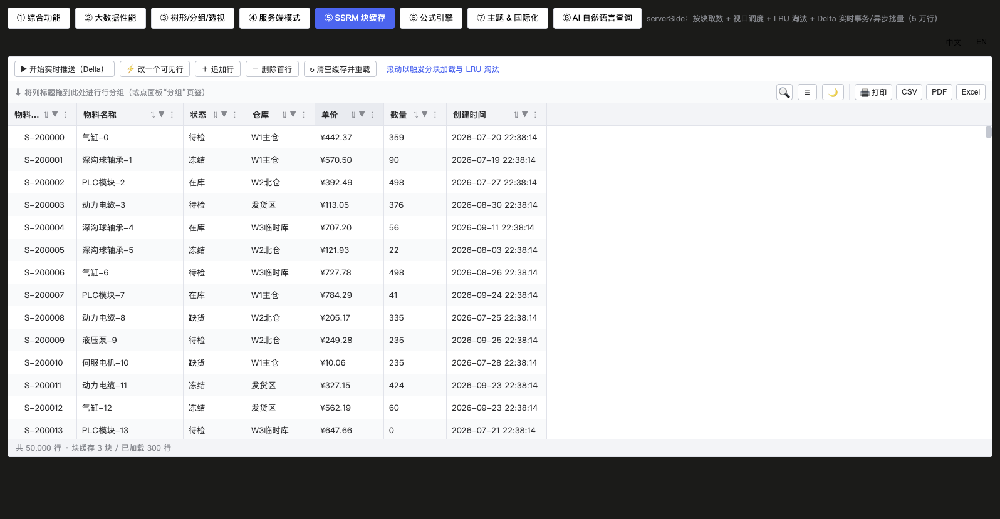

| Mode | Description | Key config |
|---|---|---|
| `client` | load everything into `rows`, sorting/filtering/grouping all on the client, virtual scrolling handles 100k rows | — |
| `infinite` | fetch the next block when scrolling to the bottom, no page numbers | `loadData` |
| `pagination` | page via the pager (position decided by `pagerPosition`, default top-right of the toolbar on the same row as the query; the full `client` mode shows no pager) | `loadData` + `pageSize` |
| `serverSide` | SSRM: block cache fetches on demand; with `serverSideGrouping`, group rows are collapsible and their triangle drills down to lazily fetch child blocks | `loadData` + `ssrm*` |

`RjLoadServerParams` automatically carries `start/end/page/pageSize/sort/filters/quickFilterText/floatFilters/rowGroup/advancedFilter/signal`; on a server-side grouping drill-down it additionally carries `type: 'group'` and `group: { rowGroupKey, level, path }` (a normal row block is `type: 'select'` with `group` omitted), and returns `{ rows/list, total, success }`. A per-request `AbortSignal` automatically cancels stale requests.

> 📌 **Server-authoritative grouping (`serverSideGrouping`)**: grouping definitions are pushed down to the backend (`p.rowGroup = [{ field, aggFunc }]`), the client doesn't rebuild the group tree, it only expands the backend's **flat** row sequence into display rows. The group-row contract fields match client-side grouping: `__group: true`, `__level` (nesting level), `__groupField`/`__groupValue`/`__groupLabels` (the display value of the group-anchor cell), `__count`, `__agg`, optional `__path` and `__footer: true` (group footer). **When fields are incomplete the engine fills them in automatically by grouping level** (a missing `__groupValue` takes the field value at that level, a missing `__groupLabels` is generated from the group-value path), so passing only `__group + __level + field values` won't produce a "(empty)" label.
>
> Child rows arrive in two ways, which can be mixed: ① **inline** — the group row is immediately followed by its data rows / deeper group rows, returned in one shot; ② **lazy** — the group row is followed by no deeper row, so the engine registers the group as pending and issues one `type: 'group'` request to fetch its children (deduplicated per group).
>
> Handling child-block fetch failures: a failure is **not** treated as "the backend confirms no children" (only an empty-array return is). The engine tries the same group at most 3 times per generation, giving up beyond that (that group shows no children for now, and no local infinite loop forms); a re-fetch, a change of grouping definition, `refreshServerSide({ purge: true })` / `purgeServerSideCache()` all clear the failure state and the already-fetched children, restoring retries. If such a reset happens mid-fetch, **in-flight stale responses are voided by generation**, so children under an old filter are never written back into the new cache. If a child reply contains a group row with the same `__path` as its parent (the backend feeding the group row back), the engine only renders it without recursing, so the stack never blows.
>
> Expand/collapse: all expanded by default, click the group-anchor triangle to collapse/expand (colliding hides its whole deeper segment), and the "expand all / collapse all" buttons plus `api.expandAll()`/`api.collapseAll()` all work; a group row whose `isServerSideGroup` returns `false` renders no triangle and issues no child-block request. Under SSRM, collapsing/lazy fetching changes the visible row count, and block scheduling converts it via a display-row→absolute-row-number mapping, so nothing misaligns; and `refreshServerSide({ purge: true })` probes total and re-lays-out blocks **at any scroll position** first (no need to return to the top).
>
> Group footer (`__footer: true`): a footer row usually shares the same level and value as its group (hence the same `__path`); the engine appends a `:footer` suffix to its row key to avoid a `v-for` duplicate-key clash with the group row (`data-rk` looks like `|0|WH1-Main:footer`); **collapsing the group collapses its subtotal row too** (consistent with client-side grouping), and the footer itself shows no expand triangle and issues no child-block request.

Live data updates: `api.applyTransaction({ add, update, remove, upsert, addIndex })` (or `applyTransactionAsync` to merge batches); under SSRM, `api.refreshServerSide({ purge })` / `api.purgeServerSideCache()`.

**Pagination mode example**

```vue
<template>
  <rj-grid
    :columns="cols"
    data-mode="pagination"
    :load-data="loadData"
    :page-size="20"
    pager-position="top"
    row-key="id"
    queryable
    @page-change="onPage"
  />
</template>

<script setup lang="ts">
import type { RjColumn, RjLoadServerParams } from 'rj-grid'
import { LocationMaterialApi } from '@/api/wms/locationMaterial' // the host's own API

const cols: RjColumn[] = [{ field: 'code', title: 'Code' }, { field: 'qty', title: 'Qty', type: 'num' }]

// the component carries sorting/filters/quick filter/query conditions all in params; the host just passes them straight to the backend
async function loadData(p: RjLoadServerParams) {
  const res = await LocationMaterialApi.getLocationMaterialPage({
    pageNo: p.page,
    pageSize: p.pageSize,
    sort: p.sort,                       // [{ field, dir }]
    filters: p.filters,                 // [{ field, model }]
    quickFilterText: p.quickFilterText,
    queryConditions: p.queryConditions, // the filled conditions in queryable mode
    floatFilters: p.floatFilters,
    advancedFilter: p.advancedFilter,
    rowGroup: p.rowGroup
  })
  return { rows: res.list, total: res.total, success: true } // the row-array field rows / list both work
}
function onPage(e: { page: number; pageSize: number }) {
  console.log('page changed', e.page)
}
// to actually cancel stale requests: pass p.signal through to axios options (request.get({ url, params, signal: p.signal }));
// the engine already generates a fresh signal per fetch, so a slow response that's stale gets aborted when it returns.
// when query conditions change: the component auto-returns to page 1 and re-fetches; for a manual re-fetch use api.refresh()
</script>
```

**Infinite scroll example**

```vue
<template>
  <!-- automatically fetches the next block at the bottom, no pager -->
  <rj-grid :columns="cols" :load-data="loadData" data-mode="infinite" :page-size="200" row-key="id" />
</template>

<script setup lang="ts">
import type { RjLoadServerParams } from 'rj-grid'

// start/end are the global row-index range, the backend fetches by between; returning lastRow=-1 means the backend doesn't know the total
async function loadData(p: RjLoadServerParams) {
  const res = await fetch(`/api/stock?start=${p.start}&end=${p.end}`)
  const { list, total } = await res.json()
  return { rows: list, total, success: true }
}
</script>
```

**SSRM (serverSide) example (block cache + server-side grouping drill-down)**

```vue
<template>
  <rj-grid
    :columns="cols"
    data-mode="serverSide"
    :load-data="loadData"
    :ssrm-block-size="100"
    :ssrm-max-blocks-in-cache="10"
    :server-side-grouping="true"
    :is-server-side-group="(row) => !!row.__group && (row.__count ?? 0) > 0"
    row-key="id"
  />
  <el-button @click="gridRef?.refreshServerSide({ purge: true })">Clear block cache and reload the viewport</el-button>
</template>

<script setup lang="ts">
import { ref } from 'vue'
import type { RjColumn, RjGridApi, RjLoadServerParams } from 'rj-grid'

const gridRef = ref<RjGridApi>()
const cols: RjColumn[] = [
  { field: 'warehouse', title: 'Warehouse', rowGroup: true },
  { field: 'qty', title: 'Qty', type: 'num', aggFunc: 'sum' }
]

// server-authoritative grouping: the backend returns a [flat] row sequence, group rows carry __group: true / __level / __groupValue (the group-label display value)
// (for a group footer give __footer: true: same level and value as its group, placed after its children; the engine gives it a separate :footer row key;
//   in multiColumn mode you can give a __groupLabels array; the engine auto-fills incomplete fields)

async function loadData(p: RjLoadServerParams) {
  // p.rowGroup = [{ field, aggFunc }] is the grouping definition pushed down to the backend
  if (p.type === 'group' && p.group) {
    // the child-block request when expanding a group: p.group = { rowGroupKey: that level's grouping field, level, path: the group-value path from the root }
    const res = await fetch('/api/stock/children', {
      method: 'POST',
      body: JSON.stringify({ group: p.group, rowGroup: p.rowGroup, filters: p.filters })
    })
    const data = await res.json()
    // next level: still group rows (drillable further); at the deepest level return data rows directly (you may append one __footer row at the end)
    // note: only one page should be returned at a time (the engine does not fetch the next page for the same group, see global note #9)
    return { rows: data.rows, success: true }
  }
  // normal row block (type 'select'): return a contiguous range of group rows + inline data rows by p.start/p.end
  const res = await fetch('/api/stock/ssrm', { method: 'POST', body: JSON.stringify(p) })
  const data = await res.json()
  return { rows: data.rows, total: data.total, success: true }
}
// a backend that doesn't return a group row's children can just give "first-screen flat + inline child rows"; collapse/expand are purely local (no request issued)
// cache management: api.refreshServerSide({ purge }) / api.purgeServerSideCache() (auto-drops lazily fetched children after a row-order reshuffle)
</script>
```

**Transaction-based partial update example (without rebuilding the whole view)**

```ts
// suits WebSocket / polling push: locate by rowKey, keeping scroll position, selection and expand state
api.applyTransaction({
  add: [newRow],            // add
  addIndex: 0,              // optional: insert position (appends to the tail if omitted)
  update: [patchedRow],     // matched by rowKey, merged in place, re-rendering only the affected cells
  remove: [goneRow],
  upsert: [rowOrPatch]      // update if present, add if not
})
// for high-frequency cases merge multiple changes into one batch: await api.applyTransactionAsync(tx)
api.refreshCells({ rowKeys: [1, 2], colIds: ['qty'] }) // redraw only (no recompute) the given cells
```

## 7. Tree / grouping / pivot


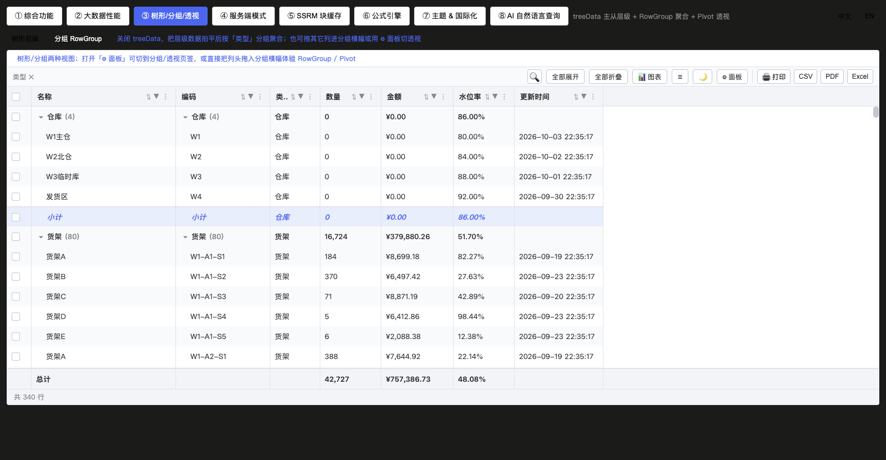


- **Tree**: `tree-data` + nested `children` (or a flat `parentField`). Nodes of arbitrary depth are expandable; the anchor column (the first visible text column) renders the indentation and triangle.
- **Row grouping**: drag a column into the group panel, or `api.setRowGroup(['cat','status'])`. Supports multi-level, group footers (`group-footer`), cascading group selection, single-/multi-column display. Row-processing priority: pivot → tree → grouping → flat (when all three are on, they shadow in this order). A group row's title goes through the grouped column's `formatter` (client-side grouping) or the backend-provided `__groupLabels` (server-side grouping), consistent with the cells in the same row; `__groupValue`, the group key and the group `path` are always the raw values (see note #19).
- **Pivot**: `allowPivot` on columns, tick pivot dimensions and measures in the tool panel; a high-cardinality guardrail prevents combination-explosion hangs; pivot columns automatically inherit the source column's formatter and type. `api.setPivot(cols, values)`.
- **Top N**: `api.setRowLimit(n)` (0 = unlimited), applied after the sort truncation; the NLQ "top-N" lands here.

**Tree example**

```vue
<template>
  <rj-grid
    :columns="cols"
    :rows="treeRows"
    row-key="id"
    tree-data
    children-field="children"
    default-expand-all
  />
</template>

<script setup lang="ts">
import type { RjColumn, RjRowData } from 'rj-grid'

// nested structure: arbitrary depth expandable; for a flat structure pass parent-field="parentId" instead
const cols: RjColumn[] = [
  { field: 'name', title: 'Material/Category', flex: 1 }, // the first visible text column is the anchor column (indent + triangle)
  { field: 'qty', title: 'Qty', type: 'num' }
]
const treeRows: RjRowData[] = [
  { id: 1, name: 'Metal parts', qty: 0, children: [{ id: 11, name: 'Bearing', qty: 100 }] }
]
</script>
```

**Row grouping example (with group footers)**

```vue
<template>
  <rj-grid :columns="cols" :rows="rows" row-key="id" group-footer @row-group-change="onGroup" />
</template>

<script setup lang="ts">
import { ref } from 'vue'
import type { RjColumn, RjGridApi } from 'rj-grid'

const gridRef = ref<RjGridApi>()
const cols: RjColumn[] = [
  { field: 'warehouse', title: 'Warehouse', rowGroup: true },   // allowed to drag into the group panel
  { field: 'status', title: 'Status', rowGroup: true },
  { field: 'qty', title: 'Qty', type: 'num', aggFunc: 'sum' } // aggregated on group rows/footers
]
const rows = ref([{ id: 1, warehouse: 'East WH', status: 'In stock', qty: 10 }])

function onGroup(fields: string[]) {
  console.log('current grouping dimensions', fields)
}
// programmatic grouping / back to flat: gridRef.value?.setRowGroup(['warehouse', 'status']) / setRowGroup([])
</script>
```

**Pivot example**

```vue
<template>
  <rj-grid :columns="cols" :rows="rows" row-key="id" tool-panel />
</template>

<script setup lang="ts">
import { ref } from 'vue'
import type { RjColumn } from 'rj-grid'

const cols: RjColumn[] = [
  { field: 'warehouse', title: 'Warehouse', allowPivot: true }, // usable as a pivot dimension
  { field: 'month', title: 'Month', allowPivot: true },
  { field: 'amount', title: 'Amount', type: 'money', aggFunc: 'sum', allowPivot: false } // measure
]
const rows = ref([{ id: 1, warehouse: 'East WH', month: '2024-01', amount: 1200 }])
// tick dimensions/measures in the tool panel; or programmatically: api.setPivot(['month'], ['amount']) (clear with setPivot([], []))
</script>
```

**Summary row + pinned rows example**

```vue
<template>
  <rj-grid :columns="cols" :rows="rows" row-key="id" show-summary :pinned-top-rows="topRows" :pinned-bottom-rows="bottomRows" />
</template>

<script setup lang="ts">
import type { RjColumn } from 'rj-grid'

const cols: RjColumn[] = [
  { field: 'name', title: 'Material', summaryLabel: true }, // put the "Total" label in this column (the engine auto-picks one if unspecified)
  { field: 'qty', title: 'Qty', type: 'num', aggFunc: 'sum' },
  { field: 'memo', title: 'Notes' } // a column without aggFunc stays blank on the summary row
]
const rows = [{ id: 1, name: 'Bearing', qty: 100, memo: '' }]
// pinned rows are excluded from selection/drag/sorting (outside the body, they don't page with data rows), good for persistent info like "month-to-date" or a notice
const topRows = [{ name: 'Month to date', qty: 3200, memo: 'for reference only' }]
const bottomRows = [{ name: 'Prepared by: Alice', qty: '', memo: '' }]
</script>
```

- The summary row is based on the **full filtered dataset** (not just the rows visible on screen), so sorting and row-drag reordering don't change the aggregate; after editing a numeric cell only the affected part is recomputed (a pure order change doesn't recompute the aggregate).
- `aggFunc` also accepts a custom function: `aggFunc: (rows) => rows.reduce((s, r) => s + r.price, 0) / rows.length`.
- When grouping rows you can additionally use `group-footer` to show an in-group aggregation footer at the bottom of each expanded group (see the row-grouping example above).

## 8. Selection / range / drag


- The checkbox column is auto-prepended (44px, pinned left, no header menu), and select-all in the header supports the indeterminate state.
- `keepSelectionCrossPage`: keep the selection across paging (note: `selectedRows() = selection ∪ preserveMap`, and every unselect path keeps both in sync).
- Range selection: mouse rectangle / Shift to extend, `api.getRangeSelection()` returns `{start:{r,c}, end:{r,c}}`; the status bar shows the selection's numeric aggregation live.
- Clipboard: Ctrl+C copy (optionally with headers), Ctrl+X cut, Ctrl+V paste (TSV matrix, preprocessed by `pasteTransformer`, run through each column's `valueParser`).
- Row drag: enabled by `row-draggable`, auto-prepending an ~34px handle column (`⠿`); **the entire handle cell (including left/right padding) is the grab area** (the `pointerdown` is lifted onto the full-height handle, so it's no longer just the small glyph strip that's draggable — grab anywhere in the cell to start), AG-style full animation (yield glide + drop FLIP + edge auto-scroll); summary rows and pinned rows are not draggable. `client` / `pagination` / `infinite` are all draggable (the rows live in an in-memory array, an in-place reorder takes effect immediately), `serverSide` doesn't inject a handle column (see §8.1, §8.2).
- Column drag reorder (three entry points, all calling `colState.moveColumn` and immediately re-laying-out the body columns): ① **header drag** (`colReorder`, drag a column header onto a target header); ② **column-menu "Columns" tab drag** (click the header menu icon → the "Columns" tab, drag the `⠿` handle before an entry to reorder; during the drag the header order and the menu list update in sync live, the menu stays open); ③ **tool-panel "Columns" drag**. The column order produced by all three is written into `getColumnState()`'s `order`, so it's captured by "save view" and persisted by `stateKey` (see §9.10).

### 8.1 Row drag example

```vue
<template>
  <!-- just one switch: auto-prepends the drag-handle column (the whole column is the grab area) -->
  <rj-grid
    :columns="cols"
    :rows="rows"
    row-key="id"
    row-draggable
    @row-drag-end="onRowDragEnd"
  />
</template>

<script setup lang="ts">
import { ref } from 'vue'
import type { RjColumn, RjRowData } from 'rj-grid'

const cols: RjColumn[] = [
  { field: 'code', title: 'Code', width: 120 },
  { field: 'name', title: 'Name', flex: 1 },
  { field: 'qty', title: 'Qty', type: 'num' }
]
const rows = ref<RjRowData[]>([
  { id: 1, code: 'A-001', name: 'Bearing', qty: 100 },
  { id: 2, code: 'A-002', name: 'Motor', qty: 30 },
  { id: 3, code: 'A-003', name: 'Hydraulic pump', qty: 8 }
])

// from / to are [display-row indexes] (0-based). Note: the reorder only affects the component's internal copy of the rows,
// the host rows array's [order] stays unchanged (row objects are shared by shallow copy, so in-cell edits write back to the host).
function onRowDragEnd(p: { row: RjRowData; from: number; to: number }) {
  console.log(`row ${p.from + 1} dragged to row ${p.to + 1}`, p.row.code)
  // to persist: reorder the business array by rowKey here (or write the order into the view / stateKey)
}
</script>
```

Usage constraints (the engine shows a hint rather than silently failing when conditions aren't met):

- Draggable modes: `client` / `pagination` / `infinite` (in all three the rows live in an in-memory array, `applyRowMove`'s in-place reorder reflects onto the display rows); under `serverSide` (SSRM) rows live in dense block slots, a reorder can't be persisted back, so **no handle column is injected** (to avoid drawing un-draggable handles that mislead users).
- The drag is refused when there is current **sorting / row grouping / pivot / tree** (reordering the source array would be immediately sorted back by the engine — a wasted drag).
- The summary row and pinned rows (`pinnedTopRows` / `pinnedBottomRows`) are not draggable; coexisting with `#cell-xxx` slots and column virtualization doesn't affect dragging.
- You can listen on the runtime event bus for finer follow-the-cursor effects: `api.addEventListener('dragStarted' | 'rowDragMove' | 'dragEnded', cb)`.

### 8.2 Row-drag semantics under pagination / infinite scroll

In `pagination` and `infinite` the rows don't come from `rows` but from the in-memory snapshot returned by `loadData`, so a drag reorders that loaded batch:

```vue
<rj-grid
  :columns="cols"
  row-key="id"
  data-mode="pagination"
  :page-size="20"
  :load-data="loadPage"
  row-draggable
  @row-drag-end="onRowDragEnd"
/>
```

- **Scope reaches only the current page (or the loaded portion)**: `from` / `to` are display indexes within this page, not global row numbers.
- **Paging / re-querying / a filter-condition change re-fetches the whole page** (`serverRows` is replaced by a new batch), the manual order is voided accordingly and reverts to the backend's return order; under `infinite`, rows appended by later `fetchMore` land at the tail and the established manual order is kept.
- **No write-back to the backend**. To persist a drag result, take `row` + `from` / `to` in `row-drag-end` and call a business API (or write the order into `loadData`'s `params.sort` and let the backend take over).
- It's recommended — as the host integration page (join-cloud-vue3 `src/views/wms/menuGrid/index.vue`, route `/wms/menu-grid`) does — to echo a line like "temporary, this page only" in `row-drag-end`, so users don't mistake it for a global sort.

### 8.3 Row selection and cross-page retention example

```vue
<template>
  <rj-grid
    :columns="cols"
    :rows="rows"
    row-key="id"
    row-selection="multiple"
    keep-selection-cross-page
    :status-bar="true"
    :status-aggregations="['sum', 'avg', 'count']"
    @selection-change="onSelectionChange"
  />
  <el-button @click="printSelected">Get selected rows</el-button>
</template>

<script setup lang="ts">
import { ref } from 'vue'
import type { RjColumn, RjRowData, RjGridApi } from 'rj-grid'

const gridRef = ref<RjGridApi>()
const cols: RjColumn[] = [{ field: 'name', title: 'Name' }, { field: 'qty', title: 'Qty', type: 'num' }]
const rows = ref<RjRowData[]>([])

function onSelectionChange(selected: RjRowData[]) {
  console.log('selected', selected.length, 'rows') // the status bar also gives the selection's sum/avg/count live
}
function printSelected() {
  // select-all / indeterminate are already built into the header checkbox; a group-row checkbox cascades to its data rows (the group row itself isn't counted)
  console.log(gridRef.value?.getSelectedRows(), gridRef.value?.getSelectedKeys())
}
// programmatic: gridRef.value?.setRowSelection(row, true) / selectAll() / clearSelection()
</script>
```

### 8.4 Range selection and clipboard example

```vue
<template>
  <rj-grid
    :columns="cols"
    :rows="rows"
    row-key="id"
    editable
    range-selection
    clipboard
    copy-headers-to-clipboard
    :paste-transformer="trimText"
  />
</template>

<script setup lang="ts">
import type { RjColumn } from 'rj-grid'

const cols: RjColumn[] = [{ field: 'qty', title: 'Qty', type: 'num' }]
const rows = [{ id: 1, qty: 10 }, { id: 2, qty: 20 }]

// pre-paste text preprocessing (e.g. stripping export quotes); the TSV rectangle is still parsed by the engine and run through each column's valueParser
const trimText = (t: string) => t.replace(/"/g, '')

// get the current rectangular selection: api.getRangeSelection() → { start: {r,c}, end: {r,c} }; api.clearRangeSelection() to clear
// mouse rectangle or Shift to extend; Ctrl+C copy (with headers), Ctrl+X cut, Ctrl+V paste
</script>
```

## 9. Core features in depth

### 9.1 Filtering (four stackable layers)


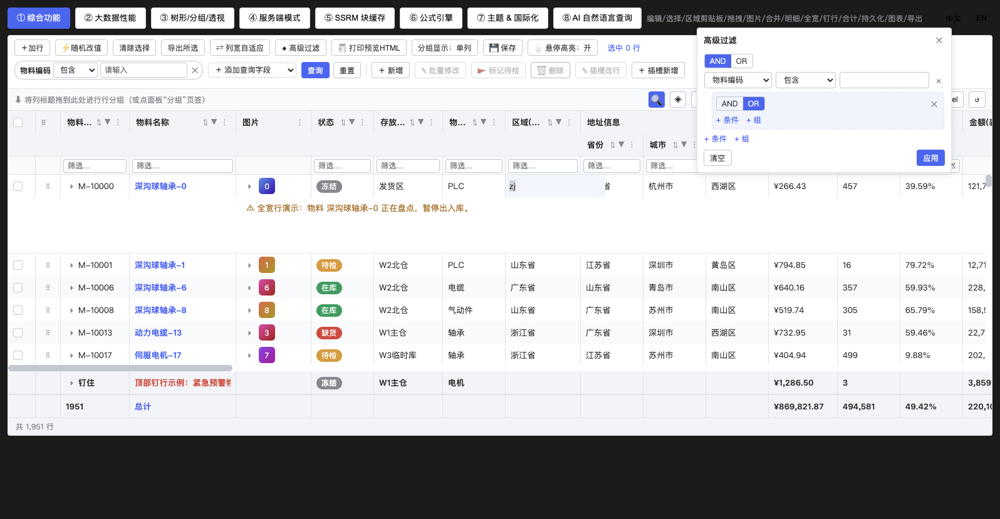

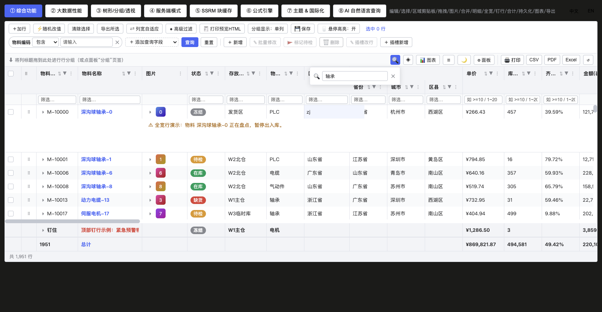

1. **Header funnel**: four kinds — text/number/date/select; number supports `>=10`, `a~b` syntax.
2. **Floating filter row**: `floating-filters`, a live input per column.
3. **Quick filter**: the toolbar input box, a contains match across all columns.
4. **Advanced filter**: entered from the column menu, a cross-column AND/OR expression tree; in SSRM mode it can be pushed down to the backend.
Clearing: the column menu's "clear filters", the toolbar, or `api.clearAllFilters()`. The four layers are a **stacked (AND)** relation — each takes effect independently without overriding the others.

**Filtering example**

```vue
<template>
  <rj-grid :columns="cols" :rows="rows" row-key="id" floating-filters @filter-change="onFilter" />
  <el-button @click="applyByCode">Programmatic: code contains A-00 and qty ≥ 100</el-button>
  <el-button @click="applyAdvanced">Programmatic: advanced filter (cross-column nested OR)</el-button>
  <el-button @click="gridRef?.clearAllFilters()">Clear all filters</el-button>
</template>

<script setup lang="ts">
import { ref } from 'vue'
import type { RjColumn, RjGridApi } from 'rj-grid'

const gridRef = ref<RjGridApi>()
const cols: RjColumn[] = [
  { field: 'code', title: 'Code', filter: 'text' },                    // header funnel: contains/equals/starts-with…
  { field: 'qty', title: 'Qty', type: 'num', filter: 'number' },      // number: ranges, >=10 syntax
  { field: 'inDate', title: 'Inbound date', type: 'date', filter: 'date' },
  { field: 'status', title: 'Status', filter: 'select' }                 // select: tick unique values
]
const rows = ref([{ id: 1, code: 'A-001', qty: 100, inDate: '2024-01-05', status: 'In stock' }])

// filterModel shape: { type, operator:'and'|'or', conditions:[{op,value1,value2}] }
// op values: text has contains/eq/ne/startsWith/endsWith/blank/notBlank;
//            number/date add gt/gte/lt/lte/inRange (inRange uses value1+value2); a select value1 must be an array.
function applyByCode() {
  gridRef.value?.setFilterModel('code', { type: 'text', operator: 'and', conditions: [{ op: 'contains', value1: 'A-00' }] })
  gridRef.value?.setFilterModel('qty', { type: 'number', operator: 'and', conditions: [{ op: 'gte', value1: 100 }] })
  // pass null to clear that column's filter: setFilterModel('qty', null)
}
// advanced filter = an expression tree: a group { operator, items }, a leaf { colId, condition, filterType }
function applyAdvanced() {
  gridRef.value?.setAdvancedFilter({
    operator: 'or',
    items: [
      { colId: 'status', filterType: 'select', condition: { op: 'eq', value1: ['In stock'] } },
      { operator: 'and', items: [
        { colId: 'qty', filterType: 'number', condition: { op: 'lt', value1: 10 } },
        { colId: 'code', filterType: 'text', condition: { op: 'startsWith', value1: 'B' } }
      ] }
    ]
  })
  // gridRef.value?.openAdvancedFilter() opens the visual editor; getAdvancedFilter() reads the tree back
}
function onFilter() {
  console.log('rows in current view', gridRef.value?.getDisplayedRowsCount())
}
// quick filter (contains match across all columns): gridRef.value?.setQuickFilter('Bearing')
</script>
```

### 9.2 Sorting
Click a header for single-column sorting, Shift+click for multi-column rotation; `api.setSort([{ field, dir }])`; the multi-column sort indicator shows the column order.

**Sorting example**

```vue
<template>
  <rj-grid :columns="cols" :rows="rows" row-key="id" @sort-change="onSort" />
  <el-button @click="sortTwo">Multi-column sort: warehouse asc + amount desc</el-button>
</template>

<script setup lang="ts">
import { ref } from 'vue'
import type { RjColumn, RjGridApi, RjSortState } from 'rj-grid'

const gridRef = ref<RjGridApi>()
const cols: RjColumn[] = [
  { field: 'warehouse', title: 'Warehouse', sortable: true },
  { field: 'amount', title: 'Amount', type: 'money', initialSort: 'desc' }, // initial sort
  // a custom comparator (e.g. order an enum by business rank rather than lexicographically)
  { field: 'status', title: 'Status', comparator: (a, b) => ORDER[a] - ORDER[b] }
]
const ORDER = { 'In stock': 0, Locked: 1, Scrapped: 2 }
const rows = ref([{ id: 1, warehouse: 'East WH', amount: 1200, status: 'In stock' }])

function sortTwo() {
  gridRef.value?.setSort([{ field: 'warehouse', dir: 'asc' }, { field: 'amount', dir: 'desc' }])
  // pass [] to cancel all sorting (restores the host rows' original order)
}
function onSort(sorts: RjSortState[]) {
  console.log('current sort', sorts) // in server modes the engine re-fetches data with the new sort automatically
}
</script>
```

### 9.3 Editing


- Editor types: `input / number / date / select / richSelect (searchable large list, matches as you type) / largeText / checkbox / custom(component)`.
- `editor.validator` validates before commit (may be async); an error message blocks the commit; `alwaysUpdate` commits instantly.
- Enter editing: F2 / double-click / type directly / `api.startEditing(r, colId)`; Enter moves down and commits, Tab moves right, Esc cancels.
- Undo/redo: `undo-redo-cell-editing`, `api.undoCellEditing()/redoCellEditing()/canUndo()/canRedo()`.
- Dirty cells: `mark-dirty-cells` marks cells that differ from their initial value, and `api.getDirtyCells()/getDirtyRows()/isDirty()/clearDirtyCells()` form a save workflow.

**Editing example (8 editor types + validation + dirty-cell save)**

```vue
<template>
  <!-- editable: the master switch; per-column editable for fine control (can be a function decided per row) -->
  <rj-grid
    ref="gridRef"
    :columns="cols"
    :rows="rows"
    row-key="id"
    editable
    undo-redo-cell-editing
    mark-dirty-cells
    @cell-value-changed="onCellChange"
  />
  <el-button :disabled="!dirty" @click="save">Save ({{ dirtyCount }} dirty cells)</el-button>
  <el-button @click="gridRef?.undoCellEditing()">Undo</el-button>
</template>

<script setup lang="ts">
import { computed, ref } from 'vue'
import type { RjColumn, RjGridApi } from 'rj-grid'

const gridRef = ref<RjGridApi>()
const cols: RjColumn[] = [
  { field: 'name', title: 'Name', editable: true, editor: 'input' },
  { field: 'qty', title: 'Qty', type: 'num', editable: true, editor: { type: 'number', props: { min: 0 } } },
  // a column-level editable function: only allow editing rows that are In stock
  { field: 'status', title: 'Status', editable: (row) => row.status !== 'Scrapped',
    editor: { type: 'select', options: [{ label: 'In stock', value: 'In stock' }, { label: 'Locked', value: 'Locked' }] } },
  { field: 'owner', title: 'Owner', editor: { type: 'richSelect', options: () => USER_OPTIONS } }, // searchable large list
  { field: 'inDate', title: 'Inbound date', type: 'date', editor: 'date' },
  { field: 'memo', title: 'Notes', editor: 'largeText' },
  { field: 'checked', title: 'Confirmed', type: 'boolean', editor: 'checkbox' },
  { field: 'level', title: 'Level', editor: { type: 'custom', component: LevelPicker } },
  // validation: returning an error message blocks the commit; valueParser parses the input into the target type
  { field: 'price', title: 'Price', type: 'money', editable: true,
    valueParser: ({ newValue }) => Number(String(newValue).replace(/[,¥]/g, '')),
    editor: { type: 'number', validator: (v) => (v == null || v < 0 ? 'Unit price cannot be negative' : null) } }
]
const USER_OPTIONS = [{ label: 'Alice', value: 'alice' }]
const rows = ref([{ id: 1, name: 'Bearing', qty: 100, status: 'In stock', price: 12.5 }])

const dirty = computed(() => gridRef.value?.isDirty() ?? false)
const dirtyCount = computed(() => gridRef.value?.getDirtyCells().length ?? 0)

function onCellChange(p: { row: any; colId: string; newValue: any; oldValue: any }) {
  console.log('committed', p.colId, p.oldValue, '→', p.newValue) // formula columns recompute automatically after this
}
function save() {
  const changes = gridRef.value?.getDirtyCells() ?? [] // [{ row, colId, oldValue, newValue }]
  // ...call a backend batch save; on success clear the dirty markers (otherwise the corner badges won't disappear)
  gridRef.value?.clearDirtyCells()
}
// programmatic: gridRef.value?.startEditing(0, 'qty') / stopEditing() / setCellValue(0, 'qty', 50)
</script>
```

### 9.4 Master-detail & full-width rows
A row matched by `fullWidthRow` renders the `#full-row` slot across the whole row; a row with an expanded detail renders the `#row-detail` slot (the scope provides `row` and `api`), heights controlled by `fullWidthHeight`/`detailHeight` respectively.

**Master-detail + full-width row example**

```vue
<template>
  <rj-grid
    :columns="cols"
    :rows="rows"
    row-key="id"
    :detail-height="200"
    :full-width-height="80"
    :full-width-row="isNotice"
  >
    <!-- full-width row: the whole row renders only once (annotation / divider strip / ad slot) -->
    <template #full-row="{ row }">
      <div class="notice">⚠ {{ row.memo }}</div>
    </template>
    <!-- master-detail: rendered below the row after expanding its leading triangle -->
    <template #row-detail="{ row, api }">
      <rj-grid :columns="subCols" :rows="row.items" row-key="id" :height="150" />
      <button @click="api.stopEditing()">Exit child-table editing</button>
    </template>
  </rj-grid>
</template>

<script setup lang="ts">
import type { RjColumn, RjRowData } from 'rj-grid'

const cols: RjColumn[] = [{ field: 'code', title: 'Inbound order' }, { field: 'qty', title: 'Qty', type: 'num' }]
const subCols: RjColumn[] = [{ field: 'mat', title: 'Material' }, { field: 'loc', title: 'Location' }]
// a row with items automatically shows an expand triangle; no extra switch needed
const rows: RjRowData[] = [
  { id: 1, code: 'IN-001', qty: 100, items: [{ id: 11, mat: 'Bearing', loc: 'A-01' }] },
  { id: 0, code: '', memo: 'The orders below are pending review', items: [] } // if it hits isNotice, #full-row is used
]
const isNotice = (row: RjRowData) => row.id === 0
</script>
```

### 9.5 Formula engine (zero dependency)


- Column-level: `formula: '=qty*price'` (field references) or `'=SUM(qty)'`.
- Cell-level: in an `allowFormula` column users type `=B2*C2`, `=SUM(ColA)`, `COUNTIF/SUMIF`, range references, etc., Excel-style.
- Recursive-descent parsing + Kahn topological evaluation + circular-reference detection: `api.recalculate(force)`, `setCellFormula/getCellFormula`, `hasFormula()`, `getCircularRefs()`. Cells participating in a cycle show `#CIRCULAR!` and are **highlighted red and bold** (the cell automatically gets an `.is-fx-err` class); the other error sentinels `#REF! #VALUE! #NAME? #DIV/0! #NUM! #N/A` are likewise highlighted red.
- Reference scope: the evaluation context = visible columns + the hidden declared columns (appended at the tail), so a dependency column can still produce a value even when not shown (see §14.12).

**Formula example**

```vue
<template>
  <rj-grid ref="gridRef" :columns="cols" :rows="rows" row-key="id" editable show-summary />
  <el-button @click="gridRef?.recalculate(true)">Force recompute</el-button>
  <el-button @click="setCellFormula">Write a cell formula on row 1's amount</el-button>
  <el-button v-if="circle.length" @click="logCircle">{{ circle.length }} circular-ref cells</el-button>
</template>

<script setup lang="ts">
import { computed, ref } from 'vue'
import type { RjColumn, RjGridApi } from 'rj-grid'

const gridRef = ref<RjGridApi>()
const cols: RjColumn[] = [
  { field: 'qty', title: 'Qty', type: 'num', editable: true },
  { field: 'price', title: 'Price', type: 'money', editable: true },
  // column-level formula: evaluated per row; the dependency column may be hidden (see §14.12)
  { field: 'amount', title: 'Amount', type: 'money', formula: '=qty*price', aggFunc: 'sum' },
  // allowFormula: anything a user types as =... in this column is stored as a formula (overriding the column-level formula)
  { field: 'remark', title: 'Remark', editable: true, allowFormula: true }
]
const rows = ref([{ id: 1, qty: 3, price: 100, amount: 0, remark: '' }])

const circle = computed(() => gridRef.value?.getCircularRefs() ?? [])
function setCellFormula() {
  // letter references resolve coordinates by "visible columns + hidden columns at the tail" (A = the 1st column); referencing by field name is more robust
  gridRef.value?.setCellFormula(0, 'remark', '=SUM(qty)')
  console.log(gridRef.value?.getCellFormula(0, 'remark'), gridRef.value?.hasFormula())
}
function logCircle() {
  console.error('circular references (already highlighted in the UI)', circle.value) // [{ row, colId }]
}
</script>
```

### 9.6 Export / print / PDF

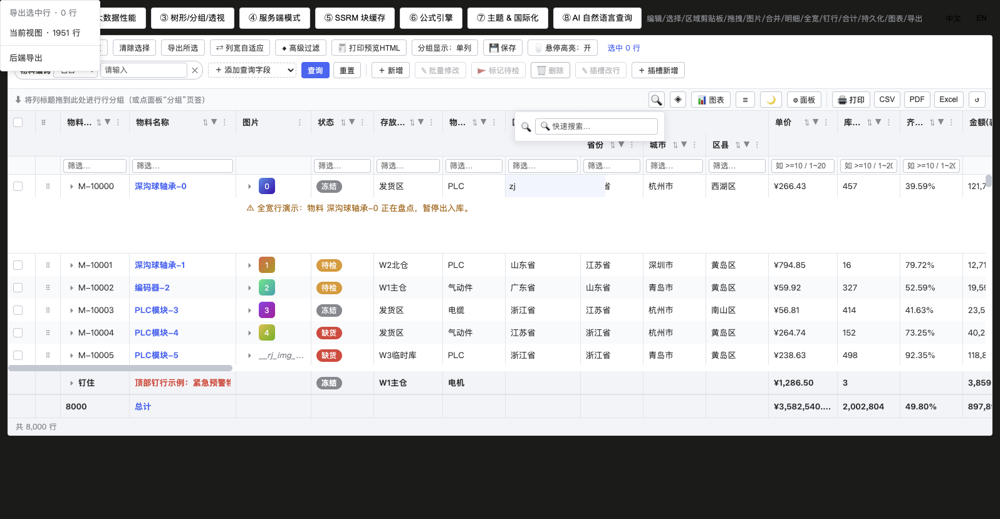


The toolbar has **four format buttons** (🖨 print / CSV / PDF / Excel); clicking any button pops up a **data-scope** menu, and once chosen it lands in that format. **Print/CSV/PDF/Excel are all front-end capabilities, zero-dependency** (print uses a hidden iframe + `window.print()`, PDF is saved via the browser's print dialog); selectable scopes = **export selected rows** (requires row selection on) / **current view** (the rows after filtering/sorting/grouping). The "**backend export**" option **appears only in CSV / Excel** and requires the host to have wired `serverExport` (print and PDF are rendered by the browser, are front-end scopes, and don't go through the backend).

**Print example**

```vue
<template>
  <!-- all four export/print buttons are master-toggled by exportable (default true); showPrint/showCsv/showPdf/showExcel hide them individually -->
  <rj-grid ref="gridRef" :columns="cols" :rows="rows" row-key="id" exportable show-summary />
  <el-button @click="printView">Programmatic: print the current view</el-button>
  <el-button @click="savePdf">PDF (also via the browser print; can Save as PDF)</el-button>
  <el-button @click="preview">Get the print HTML only (no dialog)</el-button>
</template>

<script setup lang="ts">
import { ref } from 'vue'
import type { RjColumn, RjGridApi } from 'rj-grid'

const gridRef = ref<RjGridApi>()
const cols: RjColumn[] = [{ field: 'code', title: 'Code' }, { field: 'qty', title: 'Qty', type: 'num' }]
const rows = ref([{ id: 1, code: 'A-001', qty: 100 }])

function printView() {
  // zero dependency: a hidden iframe + window.print(), no print library imported
  gridRef.value?.print({
    scope: 'view',            // auto/selected/view/all (backend export doesn't apply to print)
    title: 'Inventory count sheet',      // the document's main title
    header: 'East WH · only rows in stock', // the header subtitle
    footer: 'Prepared by: Alice',
    pageSize: 'A4',           // A4/A5/Letter/Legal/auto
    orientation: 'landscape', // default landscape (many columns, landscape fits)
    margins: 10,
    scaleToFit: true,         // auto-fit column widths to the page (table-layout:auto)
    showGridLines: true,
    zebra: true,
    pageNumbers: true,
    docTitle: 'Count order',       // the browser tab title
    docLang: 'en'
  })
}
function savePdf() {
  // PDF takes the same path as print (choose "Save as PDF" in the browser print dialog)
  gridRef.value?.exportData({ type: 'pdf', scope: 'view', title: 'Count order' })
}
function preview() {
  const html = gridRef.value?.getPrintHtml({ scope: 'selected', title: 'Selected rows preview' }) ?? ''
  console.log(html.length, 'bytes') // for your own preview container / test evidence, no dialog
}
</script>
```

**CSV / Excel export and backend export example**

```vue
<template>
  <!-- exportRange: the default scope; exportRawValues: numbers stay numeric in Excel;
       serverExport: only when passed does "backend export" appear in the menu -->
  <rj-grid
    ref="gridRef"
    :columns="cols"
    :rows="rows"
    row-key="id"
    row-selection="multiple"
    export-range="auto"
    export-file-name="stock-detail"
    export-raw-values
    :server-export="onServerExport"
  />
  <el-button @click="exportSelected">Programmatic: export selected rows to CSV</el-button>
</template>

<script setup lang="ts">
import { ref } from 'vue'
import download from '@/utils/download'
import type { RjColumn, RjGridApi, RjServerExportParams } from 'rj-grid'
import { exportUser } from '@/api/system/user'

const gridRef = ref<RjGridApi>()
const cols: RjColumn[] = [{ field: 'code', title: 'Code' }, { field: 'qty', title: 'Qty', type: 'num' }]
const rows = ref([{ id: 1, code: 'A-001', qty: 100 }])

function exportSelected() {
  gridRef.value?.exportData({ type: 'csv', scope: 'selected', fileName: 'selected.csv' })
  // column whitelist: exportData({ type:'excel', columnKeys:['code','qty'] })
  // takes the on-screen effective columns (order/visibility match the grid); the legacy fields onlySelected/currentView are still compatible
}

// backend export: the component never touches the API, it only passes the query context to the host
async function onServerExport(p: RjServerExportParams) {
  const params = {
    ...p.state,                       // filters/sort/quickFilter/rowGroup/queryConditions
    pageNo: p.paging.pageNo,
    pageSize: p.paging.pageSize,
    ids: p.selectedKeys
  }
  const blob = await exportUser(params)
  download.excel(blob as any, p.fileName) // when p.type='csv' the file name already ends in .csv
}
</script>
```

**Data scope** — the toolbar popup prunes its options dynamically by host capability: **export selected rows** (appears only with row selection `rowSelection` on and a checkbox column present; disabled with a count shown when nothing is selected), **current view** (the number of rows after filtering/sorting/grouping), **backend export** (appears only for CSV/Excel and only when the host has wired `serverExport`; print/PDF never list it). The API layer has two more scopes, `auto`/`all`:

| Scope | Rows taken | Note |
|---|---|---|
| `auto` (default) | if selected rows exist → only them; otherwise → current view | never exports an empty file when nothing is selected |
| `selected` | only selected rows (including `keepSelectionCrossPage` cross-page retention) | disabled in the menu when nothing is selected |
| `view` | current view: rows after filtering/sorting/grouping, the `view` scope appends the summary row | affected-by-selection = False |
| `all` | the full source data (no filtering/sorting) | under pagination/server modes it still contains only the loaded rows |
| `server` | handed to the host's backend export (see below) | full export by query conditions |

- Columns always come from the **on-screen effective columns** (order and visibility match the grid); hidden columns never leak into the file.
- By default it exports what-you-see formatted text; `export-raw-values` switches to raw values (numbers stay numeric in Excel).
- In pagination/server modes, choosing `view`/`all` shows a hint that "only the loaded rows are included"; for the full set use `server`.
- xlsx is a self-made OOXML with zero dependencies (including the summary row / grouping tiers; only the `view` scope adds the summary and grouping sheets); PDF/print go through a hidden iframe + browser print (savable as PDF). Backend export never includes PDF (that's browser rendering, a front-end scope).

**Backend export (full export by query conditions)**
- Only after the host passes `:server-export="(p: RjServerExportParams) => void｜Promise<void>"` does the "backend export" item appear in the menu (if not wired, it isn't listed, avoiding a dead menu item).
- The component never touches the API, it only passes the context to the host: `{ type:'csv'｜'excel', fileName, columns(effective columns), state(a getState() snapshot: filters/sort/grouping/quick filter), paging({pageNo,pageSize,total}), selectedKeys }`.
- The business page restores query conditions from `p.state` / `p.paging` in the callback, then calls `XxxApi.exportXxx(...)` + `download.excel()`.

**Programmatic**
- `api.exportData({ type, fileName, scope, columnKeys, onlySelected, currentView })`: `scope` is one of the five above; `onlySelected` / `currentView:false` are legacy-field compatibility (only effective when `scope` isn't passed).
- `api.print(params)` / `api.getPrintHtml(params)`: `params` also accepts `scope`; `RjPrintOptions` supports title/header/footer/A4~Letter/orientation/margins/scale-to-fit/grid lines/zebra/page numbers/document language.

### 9.7 Theming & i18n


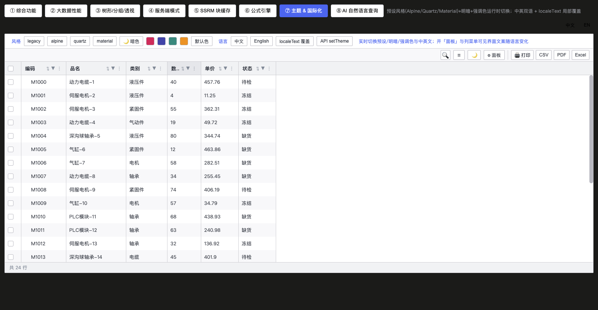

- `theme` takes an `RjThemeParams`: `preset('legacy'|'alpine'|'quartz'|'material')`, `mode('light'|'dark'|'auto')`, `accentColor` (auto-derives selected/hover colors), background/header/border/text colors, plus a raw `vars` CSS-variable escape hatch. At runtime: `api.setTheme(...)` / `api.getTheme()`.
- **Light/dark resolution priority (three tiers)**: explicit `theme` `mode` (`'light'`/`'dark'`, including `mode` inside the object) > **host `<html>` `dark`/`light` class** > OS `prefers-color-scheme`. With no `theme` or `mode:'auto'`, the grid follows the outer framework's theme toggle by default (element-plus / vben / tailwind convention: a `dark`/`light` class on `<html>`), using a `MutationObserver` on the class so it switches live without re-mounting or per-page wiring. When `<html>` carries neither `dark` nor `light`, it falls back to the OS preference (existing behavior). Set `detectHostTheme="false"` to disable host detection so `auto` tracks only the system preference.
- All theme variables compile to CSS variables attached on `.rj-grid` (overlays inherit them too, so don't Teleport them outside body).
- **Custom row/column coloring (`getRowClass` / `cellClass` + host CSS): never hard-code a light background with `!important`**, or the dark theme ends up with "light background, light text — unreadable". Prefer mixing from theme variables so both modes adapt automatically: `.low-qty { background: color-mix(in srgb, var(--rj-danger, #e54d42) 14%, var(--rj-bg)) !important; }`.
- Language: the `lang` prop or `api.setLang('en')`; `localeText` / `api.setLocaleText(patch)` overrides any text key.
- Icons: the `icons` prop / the same family of `api` mechanism replaces glyphs by semantic name (sort arrows, column menu, expand/collapse, checkbox, the `rowDrag` handle, etc.; **`rowDrag` affects both the row-drag handle column and the drag rows in the column menu's "Columns" tab**, default glyph `⠿`).

**Theming / i18n / icons example**

```vue
<template>
  <rj-grid ref="gridRef" :columns="cols" :rows="rows" row-key="id" :theme="theme" lang="en" :locale-text="localeText" :icons="icons" />
  <el-button @click="toDark">Dark + material</el-button>
  <el-button @click="toEnglish">English</el-button>
</template>

<script setup lang="ts">
import { ref } from 'vue'
import type { RjColumn, RjGridApi, RjThemeParams } from 'rj-grid'

const gridRef = ref<RjGridApi>()
const cols: RjColumn[] = [{ field: 'name', title: 'Name' }]
const rows = ref([{ id: 1, name: 'Bearing' }])

// preset × light/dark × accent color, you can also give only some of them (the rest keep the current theme)
const theme = ref<RjThemeParams>({ preset: 'quartz', mode: 'light', accentColor: '#2f6fed', fontSize: 13, radius: 4 })
// escape hatch: write any --rj-* variable directly (vars has the highest priority)
// { vars: { '--rj-header-bg': '#0b1220', '--rj-row-height': '40px' } }

function toDark() {
  gridRef.value?.setTheme({ preset: 'material', mode: 'dark' })
  console.log(gridRef.value?.getTheme())
}
function toEnglish() {
  gridRef.value?.setLang('en')
  // override built-in texts by key (higher priority than lang); the key catalog is in src/locale.ts
  gridRef.value?.setLocaleText({ clearAllFilters: 'Reset filters', tabColumns: 'Fields' })
}
// icons replaced by semantic name (default text glyphs, zero dependency); names are in src/icons.ts
const icons = { sortAscending: '↑', sortDescending: '↓', columnMenu: '⋯', filter: '⚗', rowDrag: '≡' }
const localeText = { apply: 'OK' }
</script>
```

### 9.8 State persistence
- Once `state-key` is given: column widths / visibility / pinning / order, sorting, filters, grouping, pivot, quick filter, floating filters and advanced filters are written to localStorage automatically (debounced) and restored on init; changes take effect immediately too (not only via a "save" button).
- Programmatic: `api.getState(): RjGridState` / `api.setState(state)` to store on your backend or migrate across sessions.
- Note: persistence covers only the **view structural state**, not cell-data edits.

**State persistence example**

```vue
<template>
  <!-- when a page has multiple grids, use a different stateKey to isolate them (custom views are isolated by it too) -->
  <rj-grid :columns="cols" :rows="rows" row-key="id" state-key="wms-stock-list" />
  <el-button @click="snapshot">Export the current view state</el-button>
  <el-button @click="restore">Apply the view state pulled back from the backend</el-button>
</template>

<script setup lang="ts">
import { ref } from 'vue'
import type { RjColumn, RjGridApi, RjGridState } from 'rj-grid'

const gridRef = ref<RjGridApi>()
const cols: RjColumn[] = [{ field: 'code', title: 'Code' }, { field: 'qty', title: 'Qty', type: 'num' }]
const rows = ref([{ id: 1, code: 'A-001', qty: 1 }])

// the key prefix is fixed to rj-grid-state:, so the stateKey must be globally unique
function snapshot() {
  const s: RjGridState = gridRef.value!.getState()
  // s = { columns(order/visibility/width/pinning), sort, filters, quickFilter, floatFilters,
  //        advancedFilter, rowGroup, pivot, queryConditions }
  localStorage.setItem('my-own-key', JSON.stringify(s)) // or POST it to the backend to store user preferences
}
async function restore() {
  const s = JSON.parse(localStorage.getItem('my-own-key') || '{}') as RjGridState
  gridRef.value?.setState(s) // apply the whole thing in one shot (columns read back that were never touched carry no hide, falling back to the column defs)
}
</script>
```

### 9.9 AI natural-language query (NLQ, purely offline deterministic · bilingual and following i18n)

A single Chinese or English natural-language sentence → a structured "filter + sort + grouping + top-N + global search", all parsed offline and deterministically (no large model). **The language is wired end to end**: Chinese mode uses Chinese natural language, English mode uses English natural language, and the readback and hints switch with `lang` (see below).


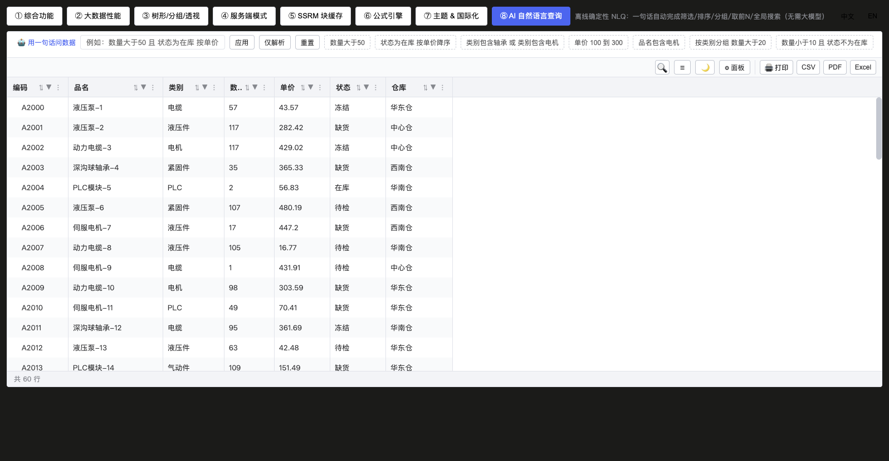

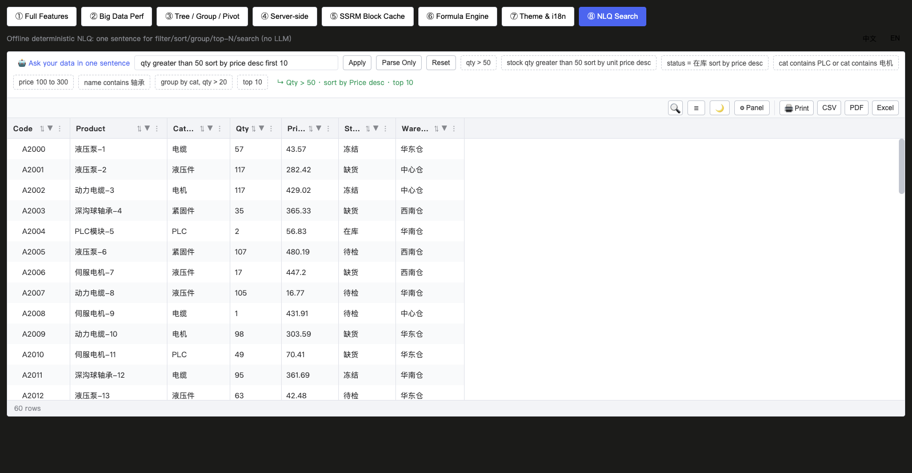

- `api.parseQuery(text)` parses only; `api.applyQuery(text)` parses and replaces the entire current view state (filter/sort/grouping/search/top-N).
- Supported phrasings (Chinese/English mixed):

| Phrasing | Effect |
|---|---|
| 数量大于100 / 金额≥50 / 金额 1000到5000 / 超过3万 | numeric filters gt/gte/inRange (supports the Chinese unit 万) |
| qty greater than 100 / at least 50 / at most 50 / below 50 / equal to 9 | English comparators are in the dictionary too (greater/less than, ±or equal to, more/most, at least/most, above/below, equal to) |
| 状态为在库 / 不为在库 / 不含 电子 | select contains/exclude |
| status is 在库 / is not 在库 / cat contains 电子 | English is / is not / contains (enum columns) |
| 名称为螺栓 / name is bolt / name is not bolt | text eq / ne (defaults to contains when there's no comparator) |
| 名称为空 / name is empty / name is not empty | empty / not empty |
| 名称包含轴承 | text contains |
| 日期在2024-01-01到2024-03-01之间 | date range |
| 按金额降序 / sort by price desc | sorting |
| 金额最高 / 单价最低 / 数量最少 | comparative sorting (highest/most→desc, lowest/cheapest/fewest→asc) |
| amount highest / price most expensive / highest amount / amount cheapest | English comparative sorting (highest/largest/most expensive→desc; lowest/cheapest/least expensive→asc) |
| 按仓库分组 / group by warehouse | row grouping |
| 取前5 / top 10 / first 10 / limit 20 / show me 5 | display limit (truncate after sorting) |
| 搜索 轴承 / 查找 电机 | quick filter |
| a bare enum word like "在库" / "轴承" | automatically resolves to a dictionary column and becomes a filter |
| multiple clauses combined (and/or, ，) | cross-column filters, or on the same column |

- Combination example: `仓库为华东仓 单价最高的前5` (warehouse is East WH, the 5 highest-priced). Column matching goes through `title`, `field` and aliases (English titles with spaces like `Stock Qty` can also lock the anchor).
- **Switching with i18n (bilingual natural language)**: the parser has built-in Chinese and English dictionaries, recognizing Chinese and English phrasings **at the same time** (offline, deterministic); when switching languages the host only needs to change the column `title` to the corresponding language (the demo page already switches by `lang`), and the input hint / example chips follow. `explainNLQ(result, lang)` takes `'zh' | 'en'` (default `zh`) and outputs a **localized** readback: Chinese like "数量 > 50 · 按单价 降序 · 前10", English like "Qty > 50 · sort by Price desc · top 10" (the operator symbols and the sort/group/top-N/search verbs all follow the language).
- The candidate-value source determines strictness (`strictOptions`): **enums declared on a column's editor** and **low-cardinality candidates sampled from all rows in `client` mode** are authoritative — if a phrasing misses the candidates it's judged `ok:false`, never producing an empty filter that must match 0 rows; in **non-`client` modes** (pagination/infinite/SSRM) only the current block/page can be sampled, candidates are incomplete, so phrasings outside the candidates are still adopted as-is (to avoid wrongly rejecting legal values).

**AI natural-language query example**

```vue
<template>
  <rj-grid ref="gridRef" :columns="cols" :rows="rows" row-key="id" />
  <input v-model="q" placeholder="e.g. warehouse is East WH highest price top 5" @keyup.enter="ask" />
  <pre>{{ explain }}</pre>
</template>

<script setup lang="ts">
import { ref } from 'vue'
import { explainNLQ, type RjColumn, type RjGridApi } from 'rj-grid'

const gridRef = ref<RjGridApi>()
const cols: RjColumn[] = [
  { field: 'warehouse', title: 'Warehouse', filter: 'select' },
  { field: 'price', title: 'Price', type: 'money' },
  { field: 'qty', title: 'Qty', type: 'num' }
]
const rows = ref([{ id: 1, warehouse: 'East WH', price: 12.5, qty: 100 }])
const q = ref('price greater than 30000 top 5')
const explain = ref('')

function ask() {
  // parseQuery parses only (for an intent preview first); applyQuery parses and [replaces] the entire current view state
  const r = gridRef.value!.applyQuery(q.value) // equivalent to parseQuery then apply
  if (!r.ok) {
    explain.value = r.message === 'empty' ? 'Please enter a query' : 'No executable condition was recognized'
    return // a parse failure never breaks the current view
  }
  explain.value = explainNLQ(r, 'en') // human readback: filter/sort/grouping/search/top-N
}
// just preview without applying: const r = gridRef.value!.parseQuery(q.value); r.filters / r.clauses are the structured intents
// reset to full: gridRef.value?.clearAllFilters(); setSort([]); setRowGroup([]); setRowLimit(0)
</script>
```

**Key points**
- `applyQuery` has **replace-whole** semantics (not additive); a failure (`ok:false`) never breaks the current view.
- `r.message` is an **internal key** (`'empty' | 'unrecognized'`), never concatenated directly for users — the host must turn it into human-readable text (see the example above).
- The dictionary matches on column `title`, so **a Chinese query needs a Chinese UI**; asking with Chinese column names under English mode silently degrades to recognizing only "top-N", without an error.

### 9.10 Dynamic query-condition bar + custom views (`queryable` / `viewable`)


This capability (the reference system's "add query fields above the table at any time + save view") used to require assembling it at page level; it has now been pushed down into `RjGrid`, and any consuming page gets it by passing two switches.

**Layout (the feature-button block and the pager swap places)**: toolbar row one — the query-condition bar is inlined at the **top-left** (the former quick-search spot, with the query/reset buttons on this row too), the **pager sits at the top-right** (in server-side pagination mode), so after querying you can page directly on the same row without scrolling down (in narrow containers it keeps only the paging buttons, hiding "N records total" and the size selector); the **second-row feature-button block** (`.rj-second-bar`, the row where the pager was previously inlined, with the "drag column headers here to group rows" banner) — quick search and views collapse into icon buttons: 🔍 opens a search input, ◈ opens the view menu, sitting on the right of this row alongside chart/density/theme/panel/export/reset; every popup is a root-level `fixed` overlay of the same family as export/column menus (no Teleport, mutually exclusive opening, opens upward only when there's no room below, never overlapping). Query/quick-search/views are shown/hidden by the `queryable` / `quickFilterEnabled` / `viewable` switches respectively, and the pager position by `pagerPosition`.

**Query-condition bar (`queryable`)**
- Query conditions are **inlined at the top-left of the toolbar** (the former quick-search spot), **preset with 1 query field by default** (the first text column, e.g. code/name); the `+ add query field` dropdown appends a `field + operator + value` chip, each removable with its own ×; the bar keeps "query / reset" buttons at the end ("save as view" is now handled by the ◈ view menu).
- Operators are auto-given sensibly per field category: text `contains/equals/not equals`; number `equals/greater/greater or equal/less/less or equal/between`; date `between/greater or equal/less or equal`; dropdown `equals/not equals/in`.
- The field pool is derived from column defs by default (skipping engine control columns and `filter:false`); enum/dictionary columns can be explicitly given `kind:'select'` + `options` via `queryFields`.
- **Effective rule**: only conditions with a filled value participate in filtering (a just-added field with no input won't wrongly produce an "empty-value filter").
- **Behavior per data mode**:
  - `client` full mode: a condition change filters instantly in the front-end `passFilter` pipeline (stacked with quick filter / column filter / advanced filter).
  - `pagination`/`infinite`/`serverSide`: conditions are surfaced via `params.queryConditions` of `loadData(params)`, for the host to pass to the backend or filter itself; it's recommended to use the shared `activeQueryConditions` + `matchQueryValue` kernel (already exported from `rj-grid`).
- Clicking the "query" button: `client` recomputes rows; server modes reset to page 1 and re-fetch under the new conditions.
- Clicking the "reset" button: **restores the condition snapshot saved by the currently active view** — e.g. the view was saved with `code = 123`, and after you change the input to `234`, reset brings it back to `123` (instead of clearing/blanking the whole page). Reset **only affects query conditions**, leaving column layout / sorting / grouping untouched; if there is **no active view**, it falls back to the old behavior of clearing all conditions.

**Custom views (`viewable`)**


- Views collapse into a **◈ button** in the second-row feature block (not a dedicated row): clicking opens the view menu — switch to an existing view by name, "save as new view" stores the current **query fields + conditions + column layout (order/visibility/width) + sorting/grouping** as a whole into a nameable snapshot, and "update current view" / "delete" maintain your own views.
- Built-in views (`builtinViews`) are read-only and always listed first; changes require "save as new view" first. Your own views are stored in localStorage under the key `rj-grid:view:<stateKey>` (so `viewable` also needs a `stateKey` for isolation).
- Switching a view applies the whole thing: back-fills conditions, restores the column layout via `applyColumnState`, restores sorting and grouping via `setSort`/`setRowGroup`; server modes re-fetch in sync.
- Events: saving/switching a view emits `@view-change` (carrying `RjSavedView`), which the host can use to sync its own state.

**Minimal usage**
```vue
<rj-grid
  :columns="cols"
  :rows="rows"
  row-key="id"
  state-key="my-grid"
  queryable
  viewable
  :query-fields="[{ field: 'status', kind: 'select', options: [{ label: 'Enabled', value: 0 }] }]"
  @view-change="onViewChange"
/>
```

**Query-condition bar + custom views full example**

```vue
<template>
  <!-- stateKey: viewable relies on it for isolation, required; queryable: the condition chips at the top-left of row one;
       viewable: the ◈ button in the second-row feature block; if queryFields isn't passed, it's derived from column defs automatically -->
  <rj-grid
    ref="gridRef"
    :columns="cols"
    :rows="rows"
    row-key="id"
    state-key="wms-stock"
    queryable
    viewable
    :query-fields="queryFields"
    :builtin-views="builtinViews"
    quick-filter-enabled
    @view-change="onViewChange"
    @filter-change="onFilterChange"
  />
</template>

<script setup lang="ts">
import { ref } from 'vue'
import type { RjColumn, RjGridApi, RjQueryFieldDef, RjSavedView } from 'rj-grid'

const gridRef = ref<RjGridApi>()
const cols: RjColumn[] = [
  { field: 'code', title: 'Code' },                // the default preset first query field (the first text column)
  { field: 'qty', title: 'Qty', type: 'num' },
  { field: 'inDate', title: 'Inbound date', type: 'date' },
  { field: 'status', title: 'Status' }                // a dictionary column: kind/options supplied via queryFields below
]
const rows = ref([{ id: 1, code: 'A-001', qty: 10, inDate: '2024-01-05', status: 0 }])

// operators are auto-given per field category: text contains/equals/not equals; number equals/greater/…/between;
// date between/greater or equal/less or equal; dropdown equals/not equals/in
const queryFields: RjQueryFieldDef[] = [
  { field: 'status', title: 'Status', kind: 'select', options: [{ label: 'Enabled', value: 0 }, { label: 'Disabled', value: 1 }] }
]
// built-in views (read-only): the host can ship common templates; user changes go through "save as new view"
const builtinViews: RjSavedView[] = [
  { id: 'builtin-today', name: 'Today inbound', queryFields: ['inDate', 'status'],
    conditions: [{ field: 'inDate', operator: 'between', value1: '2024-01-05', value2: '2024-01-05' }],
    builtin: true }
]

function onViewChange(v: RjSavedView) {
  // switching a view has applied the whole thing (conditions back-filled + column layout + sorting/grouping), just sync host state here
  console.log('current view', v.name, v.conditions)
}
function onFilterChange() {
  // client mode: only conditions with a filled value participate (a just-added field with no input won't produce an empty-value filter)
  console.log('rows matched', gridRef.value?.getDisplayedRowsCount())
}
// programmatic read/write of conditions: api.getState().queryConditions / api.setState({ queryConditions: [...] })
// server modes: conditions don't filter here, they're surfaced via params.queryConditions of loadData (the shared kernel is exported:
// import { activeQueryConditions, matchQueryValue } from 'rj-grid')
</script>
```

### 9.11 Query-bar action buttons & built-in row edit/add dialog (`queryActions` / `rowForm`)


Next to "query/reset" you can attach host-declared **business action buttons** (add, modify, mark, delete…); the matching **built-in row dialog** generates its form from column defs in two forms: **edit** (multi-selection uses diff batch semantics, back-filling via a transaction after confirm) and **add** (a blank form, assembling a new row after confirm and inserting it via an add transaction); both emit `row-form-submit` for the host to persist, and add additionally emits `row-form-add` first (the backend save contract matches `cell-value-changed`, the component never touches the API).

Two tracks coexist:
- **Declarative `queryActions`**: pass `RjQueryAction[]`, buttons render next to reset automatically; `disabled`/`confirm` can be functions evaluated over the selected rows, with the confirm dialog / disable orchestration handled by the component.
- **Slot `#query-actions`**: the scope hands out `{ api, rows, openRowForm, openRowFormAdd }`, the host draws its own buttons (appended alongside the declarative buttons, not exclusive).

Form-field admission defaults to: has `field`, isn't an engine-internal column, and declares an `editor` or `editable`; the control type is taken first from `editor.type`, otherwise mapped from the column `type` (num/money/percent→number, date/datetime→date, boolean→checkbox, select/richSelect→dropdown, largeText→multiline text); before submitting, each row runs `editor.validator`, and any failure blocks. The `rowForm.columns` hook can replace the admission rule wholesale; the add dialog uses `rowForm.addColumns` (defaulting to `columns`) — a new object often needs the code/primary-key column admitted, while batch modify doesn't want to expose them.

```vue
<template>
  <rj-grid
    :columns="cols" :rows="rows" row-key="id" :height="480" queryable row-selection="multiple"
    :query-actions="actions" :row-form="{ width: 560, addColumns: addCols, addTitle: 'Add material' }"
    @row-form-add="onAdd"
    @row-form-submit="persist"
  >
    <!-- the slot override track: the host draws its own buttons, which can also raise the built-in edit/add dialog -->
    <template #query-actions="{ rows, openRowForm, openRowFormAdd }">
      <button class="rj-btn" :disabled="!rows.length" @click="openRowForm(rows)">✎ Edit</button>
      <button class="rj-btn" @click="openRowFormAdd({ status: 'In stock' })">＋ Add</button>
    </template>
  </rj-grid>
</template>

<script setup lang="ts">
import type { RjColumn, RjRowData, RjQueryAction } from 'rj-grid'

const cols: RjColumn[] = [
  { field: 'name', title: 'Name', editable: true },
  { field: 'status', title: 'Status', filter: 'select', editor: { type: 'select', options: [{ label: 'In stock', value: 'In stock' }, { label: 'Frozen', value: 'Frozen' }] } },
  { field: 'phone', title: 'Phone', editor: { type: 'input', validator: (v) => String(v || '').length < 7 ? 'Number too short' : null } }
]
const rows = ref<RjRowData[]>([/* ... */])

// the add form additionally admits name/phone (batch modify doesn't take them)
const addCols = (c: RjColumn) => c.field === 'name' || c.field === 'phone' || c.field === 'status'

const actions: RjQueryAction[] = [
  // add: doesn't depend on selected rows, always available; preset pre-fills default fields outside the dialog
  { name: '＋ Add', onClick: (ctx) => ctx.openRowFormAdd({ status: 'In stock' }) },
  // batch modify: disabled with nothing selected; only the fields ticked in the dialog are written to all selected rows
  { name: '✎ Batch modify', disabled: (rs) => !rs.length, onClick: (ctx) => ctx.openRowForm() },
  // delete: confirm goes through the built-in confirm dialog, then a host-side transaction (row delete also supports the async SSRM applyTransactionAsync)
  {
    name: '🗑 Delete', danger: true, disabled: (rs) => !rs.length,
    confirm: (rs) => `Delete the ${rs.length} selected rows?`,
    onClick: (ctx) => { ctx.api.applyTransaction({ remove: ctx.rows.slice() }); ctx.api.clearSelection() }
  }
]

// add save: the component has already added the new row into the grid (a flashing highlight), complete the primary key here then persist
function onAdd(p: { row: RjRowData; changes: Record<string, any> }) {
  myApi.create(p.row).then((saved) => Object.assign(p.row, saved)) // write back the backend-generated id etc.
}

// the component has already back-filled/inserted locally; this only handles persistence (changes = this commit's field→newValue, mode distinguishes the two forms)
function persist(p: { rows: RjRowData[]; changes: Record<string, any>; mode: 'edit' | 'add' }) {
  if (p.mode === 'edit') myApi.batchUpdate(p.rows.map((r) => r.id), p.changes)
}
</script>
```

Key points:
- Edit with single selection = all fields pre-filled, edit directly; multi-selection = fields default to "don't modify", only ticked ones batch-assign (diff semantics, avoiding silently overwriting all rows with the first row's value).
- Add = a blank form (`openRowFormAdd(preset?)`, preset values pre-fill and participate in function-form `editor.options` evaluation); after saving, the new row is assembled via `createFormRow` (a shallow copy of preset + form values, nested paths auto-created), inserted via `applyTransaction({ add })` and flashed; the primary key is completed by the host in `row-form-add` (same contract as `cell-value-changed`, the component issues no request).
- `api.openRowForm(rows?)` / `api.openRowFormAdd(preset?)` can also be called directly from the host's toolbar / context menu; when `rowForm=false` both capabilities are disabled entirely.
- For complex forms (master-detail, cascading selects, etc.) that don't fit the built-in dialog: don't use `openRowForm`, just raise the host's own page-level dialog in `onClick`.
- The pure kernel is exported (`buildFormFields` / `applyFormChanges` / `createFormRow`): a host's custom dialog can keep the same field-derivation/validation contract as the built-in dialog.

### 9.12 Context menu / column menu / tool panel

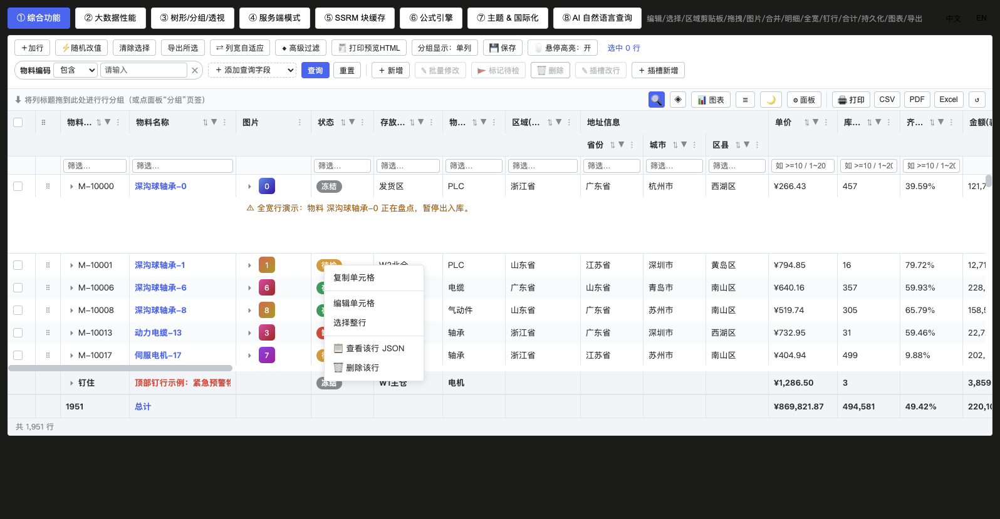

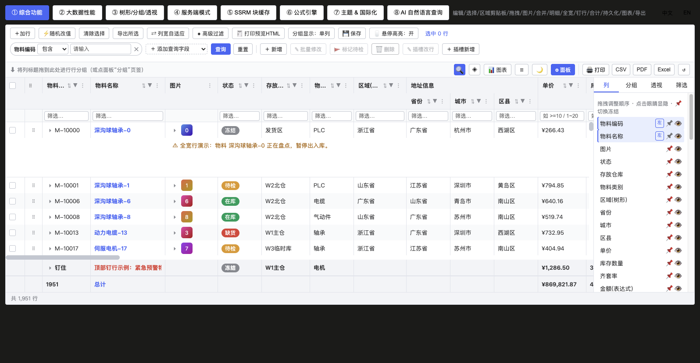


**Context menu example**

```vue
<template>
  <!-- contextMenu: true uses the default menu; passing a function makes it fully custom (supports second-level sub-items, separators, disable checks) -->
  <rj-grid :columns="cols" :rows="rows" row-key="id" :context-menu="buildMenu" />
</template>

<script setup lang="ts">
import type { RjColumn, RjMenuContext, RjMenuItem } from 'rj-grid'

const cols: RjColumn[] = [{ field: 'code', title: 'Code' }, { field: 'qty', title: 'Qty', type: 'num' }]
const rows = ref([{ id: 1, code: 'A-001', qty: 10 }])

function buildMenu(ctx: RjMenuContext): RjMenuItem[] {
  const { api, row, column } = ctx
  return [
    { name: 'Copy cell', icon: '⧉', action: () => api.copySelectedToClipboard() },
    { name: 'Filter by this column', icon: '⚗', disabled: () => !column, action: () => column && api.openAdvancedFilter() },
    { isSeparator: true },
    {
      name: 'Aggregation',
      children: [
        { name: 'Sum', action: () => api.setSort([{ field: 'qty', dir: 'desc' }]) },
        { name: 'Count', action: () => api.setSort([]) }
      ]
    },
    { name: 'Delete this row', icon: '✕', disabled: () => !row, action: () => row && api.applyTransaction({ remove: [row] }) }
  ]
}
</script>
```

**Declarative custom menu (`contextMenus`, v0.3.0+)**: same spirit as column `actions` — you only declare your own items and they are appended after the built-in ones; declaring it turns the context menu on by itself, no `contextMenu` prop needed:

```vue
<template>
  <rj-grid :columns="cols" :rows="rows" row-key="id" :context-menus="menus" />
</template>

<script setup lang="ts">
import type { RjContextMenuItem } from 'rj-grid'

const menus: RjContextMenuItem[] = [
  { name: 'json', icon: '📋', label: 'View Row JSON', onClick: (c) => showJson(c.row) },
  { name: 'tools', label: 'More Tools', children: [
    { name: 'audit', label: 'Audit Log', onClick: (c) => audit(c.rowIndex) },
    { separator: true },
    { name: 'whoami', label: 'Report Row Index', onClick: (c) => log(c.rowIndex, c.value) }
  ]},
  { name: 'del', icon: '🗑', label: 'Delete Row', danger: true,
    visible: (c) => !!c.row,                        // hidden over blank area / group rows
    disabled: (c) => c.row?.status === 'LOCKED',
    confirm: 'Delete this row?',                     // built-in confirm dialog
    onClick: (c) => c.api?.applyTransaction({ remove: [c.row] }) }
]
</script>
```

- `label` falls back to `name`; `icon` is prepended to the text; `visible`/`disabled`/`confirm` accept a boolean or a `(ctx) => ...` function; the `ctx` passed to `onClick(ctx)` is `{ row, column, colId, rowIndex, value, api, event }`.
- Every click also emits the `@context-menu-action` event (with `item`) so you can listen once at grid level; it coexists with the legacy `contextMenu` function (order: built-in items → legacy function items → declarative items).
- **Trigger scope (v0.3.2+)**: the grid context menu only takes over right-clicks that **hit a row**. Right-clicks on blank body area (below the last row / empty table) and inside editable elements (cell editor, floating filter inputs, popup search boxes) always fall through to the native browser menu, so copy/paste is never blocked. The same holds when you **select text in a cell and then right-click** (v0.3.4+): the browser's native "Copy" menu is kept, so you can lift a value out of a cell and paste it into a filter box etc.; a plain right-click with no selection still opens the grid menu.
- **Built-in "View Row JSON" (`rowJson`, v0.3.3+)**: whenever the context menu is enabled and a data row is hit, the built-in item appears after "Select Row" automatically — zero host wiring. Clicking it opens a built-in dialog (same root-level fixed-mask family as the confirm dialog, fully driven by `--rj` theme variables, light/dark follow the grid automatically): pretty-printed JSON, selectable text, one-click copy (the button briefly reads "Copied" as feedback), mask/✕/Close to dismiss; circular references degrade to `"[Circular]"`, function values serialize to their source text, and it never throws. Set `:row-json="false"` to drop just this item.

- **Column menu** (click the `⋮` icon in the header): built-in "sort / filter / columns (drag `⠿` to reorder) / grouping / pivot" tabs; `suppressMenu: true` on a column turns it off. `api.openAdvancedFilter()` directly raises the advanced-filter editor.
- **Tool panel** (`tool-panel`, on by default): "columns" drags column order + eye-icon visibility + 📌 pinning, plus pivot dimension/measure ticks.
- **The pin state is distinguished by three signals across both entry points (the column menu's "Columns" tab / the tool panel's "columns")**, not relying on the pin's own color (the default glyph `📌` is an emoji, colored glyphs don't honor CSS `color`, so changing only the color changes nothing):

| Effective state | Entry row | Pin | Side label | `title` |
|---|---|---|---|---|
| Pinned | theme-tinted background + a left color bar (`is-pinned`) | **grayscale** (`is-on` + `filter: grayscale(1)`), restored to color on hover | a `Left` / `Right` outlined mini-label | "Pinned left · unpin" / "Pinned right · unpin" |
| Not pinned | no background | original color | none | "Pin column" |

Click semantics (identical across both entry points): **not pinned → pin to the left; already pinned → unpin** (regardless of whether the pin came from the column def's `fixed` or a user pinning it manually, one click clears it). For precise right-side placement, use the "general" tab's "pin left / pin right", or `api.setColumnPinned(colId, 'right')`.
- **The two pin options in the "general" tab also report the effective state** (the same `pinOf`, passed in by the parent via the `pinned` prop): the effective option shows a trailing `✓` + a whole-row theme-tinted background and left color bar (`is-active`), title "Pinned left/right · unpin"; **clicking the same option again turns it into unpin** (no empty "re-pin to the same side" op), while the other side switches the pin over directly. The "unpin" item appears only when a pin is effective (clicking it while unpinned would just write a redundant `null` override, so that entry is taken down).
A panel entry shows the **effective pin** (`pinOf(col)` = the user's tri-state override ?? the column def's `fixed`), same source as `computeLayout`'s left/center/right partition, so a column like "No." that wrote `fixed: 'left'` in the column def enters the panel already grayscale with a `Left` label, never showing the self-contradictory "header pinned but panel says unpinned".

Column visibility/pinning/width can also be handled fully programmatically:

```ts
api.setColumnVisible('creator', true)  // can open a column marked hidden:true in the column defs (tri-state override)
api.isColumnHidden('creator')          // reads the effective visibility: true = hidden
api.setColumnPinned('code', 'left')    // 'left' | 'right' | null
api.setColumnWidth('code', 160)        // clamped internally by minWidth/maxWidth
api.autoSizeColumn('code'); api.autoSizeAll(); api.sizeColumnsToFit()
api.getColumns()                        // coordinates of all leaf columns (including hidden ones)
// column-layout changes can be subscribed on the bus: api.addEventListener('columnEverythingChanged', cb)
```

### 9.13 Toolbar feature-button block at a glance (search / views / density / panel / print)

The **feature-button block** on the right of the toolbar's second row (`.rj-second-bar`, `showToolbar`) gathers the everyday display and output operations, from left to right: **🔍 quick search · ◈ views · expand/collapse all · 📊 chart · ☰ density · 🌙 theme · ⚙ panel · 🖨 print / CSV / PDF / Excel · ↺ reset** (each button is shown/hidden by its switch, so unneeded features take no space).

| Button | Purpose | Switch | Details |
|---|---|---|---|
| **🔍 Quick search** | type a keyword in the popup, a contains match across all columns with instant highlight filtering (surfaced with data fetch in server modes) | `quickFilterEnabled` | §9.1 |
| **◈ Views** | opens the view menu: switch / save as new view / update / delete (a snapshot of query conditions + column layout + sorting/grouping) | `viewable` + `stateKey` | §9.10 |
| **☰ Density** | cycles three levels (medium→large→small), row height/font size and the whole UI scale proportionally, title shows the current level | `density` | §3 |
| **⚙ Panel** | toggles the column tool panel (column visibility/sorting/grouping/pivot drag management) | `toolPanel` | §9.12 |
| **🖨 Print / CSV / PDF / Excel** | clicking any format opens the scope menu (selected rows / current view; CSV/Excel add "backend export" once `serverExport` is wired). The four buttons are master-toggled by `exportable` and can be individually hidden via `showPrint`/`showCsv`/`showPdf`/`showExcel` | `exportable` / `showPrint`, etc. | §9.6 |
| **↺ Reset** | one click back to the initial column state (clears column order/visibility/width, paired with `stateKey`) | — | §9.8 |

**Three density levels** (small / medium / large) — row height and font size, and the toolbar/inputs/pager/query chips scale proportionally, suiting scenarios from "fit more on screen" to "roomy and readable":


> The complete usage and code examples for quick search, views and print are in §9.1 / §9.10 / §9.6 respectively; this section is only an entry-point overview.

## 10. Imperative API (get `RjGridApi` via `ref` or the `ready` event)

| Domain | Methods |
|---|---|
| Data | `setRowData` `updateRow` `applyTransaction(Async)` `getDisplayedRowAtIndex` `getDisplayedRowsCount` `getVisibleRange` `getCellValue` `setCellValue` `refresh` `refreshCells` |
| SSRM | `refreshServerSide({purge})` `purgeServerSideCache` |
| Selection | `getSelectedRows` `getSelectedKeys` `setRowSelection` `selectAll` `clearSelection` `openRowForm(rows?)` `openRowFormAdd(preset?)` |
| Sort/filter | `setSort` `setFilterModel` `clearAllFilters` `setQuickFilter` `setAdvancedFilter` `getAdvancedFilter` `openAdvancedFilter` |
| Grouping/tree/pivot | `setRowGroup` `setRowLimit` `expandAll` `collapseAll` `setPivot` |
| Scroll/edit | `scrollTo(rowIndex, colId?)` `startEditing` `stopEditing` |
| Undo/dirty | `undoCellEditing` `redoCellEditing` `canUndo` `canRedo` `isDirty` `isCellDirty` `getDirtyCells` `getDirtyRows` `clearDirtyCells` |
| Formula | `recalculate` `setCellFormula` `getCellFormula` `hasFormula` `getCircularRefs` |
| Export/print | `exportData` `exportCurrentAsCsv` `print` `getPrintHtml` `copySelectedToClipboard` |
| Range/width | `getRangeSelection` `clearRangeSelection` `sizeColumnsToFit` |
| Columns | `getColumns` `setColumnVisible(colId, visible)` `isColumnHidden(colId)` `setColumnPinned(colId, 'left'\|'right'\|null)` `setColumnWidth(colId, px)` `autoSizeColumn` `autoSizeAll` |
| Traversal | `forEachNode((data, index, drow) => ...)` |
| State | `getState` `setState` |
| Theme/language | `setTheme` `getTheme` `setLang` `setLocaleText` |
| AI | `parseQuery` `applyQuery` |
| Bus | `addEventListener(type, cb)` (returns an unsubscribe function) `removeEventListener` `dispatchEvent` |

Column-related bus events: `columnVisible` `columnMoved` `columnPinned` `columnResized`, plus `columnEverythingChanged` uniformly re-emitted after any operation that changes the column layout (when a host page wants to flow the "real column layout" back to its own state, subscribing to just this one is enough).

```vue
<template>
  <!-- ref gets the instance; or listen to the @ready event to get api (suits v-for / lazy-mount scenarios) -->
  <rj-grid ref="gridRef" :columns="cols" :rows="rows" row-key="id" @ready="onReady" />
</template>

<script setup lang="ts">
import { onUnmounted, ref } from 'vue'
import type { RjColumn, RjGridApi } from 'rj-grid'

const gridRef = ref<RjGridApi>()
const cols: RjColumn[] = [{ field: 'code', title: 'Code' }, { field: 'qty', title: 'Qty', type: 'num' }]
const rows = ref([{ id: 1, code: 'A-001', qty: 10 }])

function onReady(api: RjGridApi) {
  // the runtime event bus: unlike template @emit it can be added/removed dynamically, and returns an unsubscribe function
  const off = api.addEventListener('rowSelectionChanged', (e) => console.log('selected', e.selected))
  api.addEventListener('columnEverythingChanged', () => console.log('column layout changed, flow it back to host state here'))
  onUnmounted(off) // remember to unsubscribe
  // a few common combos:
  api.applyTransaction({ upsert: [{ id: 1, code: 'A-001', qty: 99 }] })
  api.scrollTo(1000, 'qty')                 // jump to a row (optionally to a column)
  api.setRowLimit(20)                        // top N (0 = unlimited)
  const n = api.getDisplayedRowsCount()      // rows in the current view
  api.forEachNode((data, i) => i < 3 && console.log('first 3 rows', data.code, n))
}
</script>
```

## 11. Slots

| Slot | Scope | Description |
|---|---|---|
| `#toolbar` | `{ api }` | the extension area on the left of the toolbar |
| `#loading` | — | a custom loading overlay |
| `#empty` | — | the empty-data placeholder |
| `#row-detail` | `{ row, api }` | master-detail content |
| `#full-row` | `{ row, api }` | full-width row content |
| `#cell-<colId>` | `RjCellParams` | a custom cell for any column (takes priority over cellRenderer; also applies to the summary row, so you must fall back to `params.value` yourself) |
| `#header-<colId>` | `{ column }` | a custom header for any column |

**Slot example**

```vue
<template>
  <rj-grid :columns="cols" :rows="rows" row-key="id" show-summary>
    <!-- the extension area on the left of the toolbar (can get api) -->
    <template #toolbar="{ api }">
      <el-button size="small" @click="api.refresh()">Refresh</el-button>
      <el-button size="small" @click="jump(api)">Jump to row 1000</el-button>
    </template>

    <!-- per-column customization: colId = the column's colId (defaults to field) -->
    <template #cell-status="{ value, row }">
      <el-tag :type="value === 0 ? 'success' : 'info'">{{ row.statusText }}</el-tag>
    </template>

    <!-- taking #cell-xxx means you own that cell's rendering, so the summary row is taken over too: you must fall back to the value api computed yourself -->
    <template #cell-qty="{ value }">
      <b v-if="typeof value === 'number'">{{ value }}</b>
      <span v-else>{{ value }}</span> <!-- the "Total" label and cells without aggregation both land here -->
    </template>

    <template #header-amount="{ column }">
      {{ column.title }} <i class="hint">incl. tax</i>
    </template>

    <template #empty>No stock data</template>
    <template #loading><span class="spin">Loading…</span></template>
  </rj-grid>
</template>

<script setup lang="ts">
import type { RjColumn } from 'rj-grid'

const cols: RjColumn[] = [
  { field: 'code', title: 'Code' },
  { field: 'status', title: 'Status' },
  { field: 'qty', title: 'Qty', type: 'num', aggFunc: 'sum' },
  { field: 'amount', title: 'Amount', type: 'money' }
]
const rows = [{ id: 1, code: 'A-001', status: 0, statusText: 'Enabled', qty: 10, amount: 100 }]
function jump(api?: any) {
  api?.scrollTo?.(1000)
}
</script>
```

- Slots take priority over a column's `cellRenderer`; for a column with both, the slot wins.
- **The content of `#cell-<colId>` / `cellRenderer` is always rendered as real vnodes (consistent across data rows, group rows, and the summary row)**: interactive components inside the slot (`el-switch`, buttons, lists with `:key`, etc.) keep working event bindings and CSS transitions, so you'll no longer see "hovering to another row throws `emitsOptions` / tags stuck in the transparent enter-from state / switches not clickable". If an existing `cellRenderer` returns only a string/number, behavior is unchanged (escaped as text, HTML is not parsed).
- The container of cell custom content (slot / `cellRenderer`) now resets its `line-height` to `normal`: multi-line block content (e.g. a "field name + table.column" two-line cell) stacks at natural line height and no longer overlaps adjacent rows (provided the total content height stays within the current row height; otherwise it is still clipped by `overflow:hidden` — prefer a taller `density`/row height for multi-line cells).
- Restraint advice: only use `#cell-xxx` on columns that genuinely need customization (that column then stops going through the built-in formatting/image/sparkline rendering).

## 12. Keyboard shortcuts

| Key | Function |
|---|---|
| ↑↓←→ | active-cell navigation |
| Enter | commit the edit and move down |
| Tab / Shift+Tab | commit and move right/left |
| F2 / type directly | enter editing |
| Esc | cancel editing / close overlay menus |
| Ctrl+A | select all (in a range-selection context) |
| Ctrl+C / Ctrl+X / Ctrl+V | copy / cut / paste |
| Ctrl+Z / Ctrl+Y (or Ctrl+Shift+Z) | undo / redo edits |

## 13. Demo page & verification


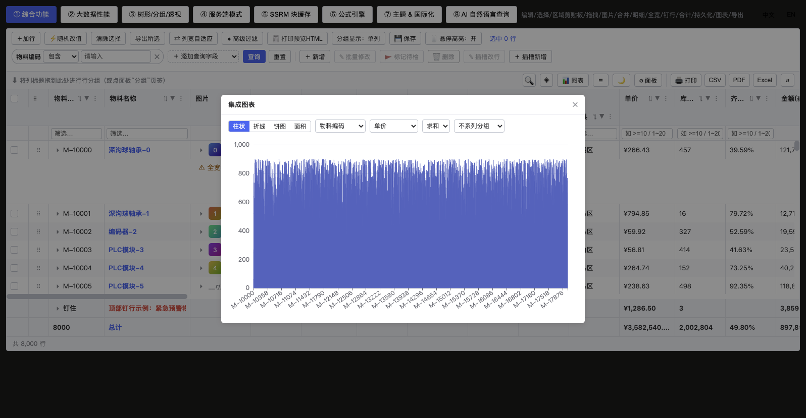

The demo page (the standalone repo's `playground/`, `pnpm dev` starts the server) — its 8 tabs are the feature map and also the regression entry: ① full features ② 100k-row performance ③ tree/grouping ④ pagination/infinite scroll ⑤ SSRM ⑥ formulas ⑦ theming/i18n ⑧ AI query.

The real-API regression page: `/wms/menu-grid` (system menu data, ① pagination 20/page, ② full rows) has `queryable + viewable` applied, so you can directly verify dynamic query fields and custom views.

Maintainer verification commands (PowerShell, all offline):

```powershell
# the four gates (run inside the rj-grid standalone repo)
pnpm test       # unit tests: 407 passed / 0 failed
pnpm ts         # vue-tsc --noEmit -p tsconfig.json (the project's own config)
pnpm lint       # eslint (index.ts / src / __tests__ / playground) + stylelint (src/styles/*.scss)
pnpm build      # vite lib build → vue-tsc d.ts → the five rjDistCheck health guards
pnpm size       # bundle size report (vite.size.config.ts + build/rjSizeReport.mjs)

# the demo page's own server (playground/, 8 tabs)
pnpm dev        # defaults to http://localhost:5173
```

## 14. Caveats & known boundaries

1. **row-key is required**: otherwise selection / persistence / transactions / cross-page retention behave unreliably.
2. Row-model priority: **pivot → tree → grouping → flat**. When tree and grouping are both on, the grouping panel is inert (shadowed by the tree); demo ③ provides a switch between the two modes.
3. Persistence covers only the **structural state**, data edits don't enter localStorage; when restoring a stale pivot column id the engine automatically falls back to "all measures".
4. The summary row / pinned rows render no checkbox and are not draggable; the "Total" label column is auto-picked, and can be explicitly set via a column's `summaryLabel`. Sharing it with a `#cell-xxx` slot requires the slot to fall back to the label value itself.
5. Checkbox / drag narrow control columns default to `suppressMenu` (no column-menu icon); custom narrow columns can set it too to avoid overlapping header icons.
6. Overlays (filter panel / context menu / column menu, etc.) must stay within the `.rj-grid` subtree to inherit the theme CSS variables — don't Teleport them to body.
7. NLQ is deterministic offline parsing: free syntax beyond comparatives, bare enums and search phrases isn't guaranteed to match; a parse failure returns `ok:false` with a hint and never breaks the current view. `applyQuery` has **replace-whole** semantics (each round clears the previous round's filter/sort/grouping/search/limit). Column anchors recognize only a column's `title`/`field`/aliases: asking in Chinese under an English UI (English column titles), or asking in pure spoken English under a Chinese UI, both yield `ok:false` (no silent empty execution); English comparators (`greater than`/`at least`/`is not` …) are in the dictionary, equal in value to Chinese.
8. A select filter's `value1` must be an array (the same convention for NLQ / programmatic use).
9. **A server-side group's child block fetches one page at a time**: the `type:'group'` request sent on a lazy expand carries `pageSize = max(ssrmBlockSize, pageSize, 100)`, and the engine no longer fetches multiple blocks for the same group; if children may exceed that, the backend should aggregate on its own within that one response (or return only the first-level group rows to keep drilling), rather than expecting the front end to scroll to the group's bottom and send another request.
10. When the viewport is hidden, the browser throttles rAF, so animation / screenshot-based automated tests must take evidence from DOM readings.
11. Don't make an image column the summary-label host (it renders the text as a URL and breaks the image; the engine already avoids this automatically).
12. **Column visibility is a tri-state override**: the effective hidden = the user override (`true` forces hidden / `false` forces shown) takes priority, and when not overridden it follows the `hidden` of the `columns` prop. So the tool panel's eye icon reports the *effective* visibility, and `setColumnVisible(colId, true)` can open a column that was marked `hidden: true` by default. When reading `getState().columns` note: columns the user never touched carry no `hide` field, so computing visible columns yourself must fall back to the column defs. A host driving `columns` via a computed still works, not conflicting with panel overrides (panel takes priority).
13. **A formula column can live on a different screen than its dependency columns**: the formula context = visible columns + the hidden declared columns (hidden columns are appended at the tail, so they don't shuffle the A/B/C letter references); so opening only a formula column like `=usedVolume / capacityVolume` while its dependency columns stay hidden still produces the value. Two exceptions: in the pivot state the column source is engine-generated `__pv*` columns, the formula context doesn't mix in declared columns; and when writing a letter reference like `B2`, the coordinate corresponds to "visible columns + hidden columns at the tail", so extra hidden columns shift the later letters (referencing by field name is more robust).
14. **The feature-button block is on the second row (same row as the grouping banner), the pager on the top-right of row one, popups are mutually exclusive and never overlap**: toolbar row one's left is slots and the query-condition bar (with query/reset), the right is the pager (on the same row as the query, page right after querying); 🔍 quick search, ◈ views (+ the naming box), chart/density/theme/panel/export/reset are on the **right of the second row** — the row where the pager was previously inlined (the left is the row-grouping banner, two panes on one row add no extra height; dragging a column header past the button area won't accidentally trigger grouping). Popups still render within the `.rj-grid` subtree as the export/column-menu family, sharing the `--rj` theme variables, never Teleporting to body (which would lose theme variables, with a transparent background stacking text); they open downward by default and **flip upward** when there's no room below (flipping by the estimated menu height, then re-anchoring by the real height after render, the bottom edge never pressing an adjacent button; quick search / view menu / naming box are mutually exclusive, never sharing a screen). The query-condition bar is inlined at the top-left of row one (not a popup). Operator/value inputs all use native `select`/`input`, without pulling in Element Plus.
15. **The three density levels (small/medium/large) are wired end to end**: row height is synced by JS (30/36/44, for virtual scrolling), and the UI scale goes through the CSS-variable trio `--rj-ui-h/--rj-ui-font/--rj-ui-pad` (switched by the root class `rj--small/rj--medium/rj--large`): the toolbar / second row's every `.rj-btn`, `.rj-input`, the pager, query chips and icon-square keys (`.rj-tool-btn`) all reference these variables and scale proportionally. When adding a custom toolbar control, **don't hard-code 26px/12px** — use `var(--rj-ui-h, 26px)`/`var(--rj-ui-font, 12px)` throughout, or it misaligns with its surroundings at the large/small levels.
16. **`viewable` depends on `stateKey`**: your own views are stored in localStorage isolated by `rj-grid:view:<stateKey>`; without a `stateKey`, views are only available in-memory for the current session. The query conditions themselves are persisted along with `queryConditions` of `getState()` (requires `stateKey`).
17. **Column widths auto-fit by default**: at init, for data columns with **no explicit width** (no `width`/`flex` on the column, never dragged by the user), they are widened by a weighted character-width estimate of "title + the display text of the first 200 rows" (CJK/full-width counts 2, half-width counts 1, reserving for header icons and left/right padding), so text is fully shown by default. Priority: user drag / persisted width > the column def's `width` > content auto-fit > 120. The auto-fit value is written only to the internal `autoWidthMap`, **not to `widthMap`**, so it isn't treated as a "user-adjusted width" and stored into a view; after a user manually drags a width, that column's `widthMap` takes priority and the view saves normally.
18. **Fitting the same row in a narrow container relies on tightening gaps, not `flex-shrink`**: members of a `flex-wrap: wrap` container **wrap first, don't shrink** — adding `flex-shrink: 1; min-width: 0` to the pager doesn't stop it wrapping to a second row (measured: 1.8px short and it wraps). So under `@media (max-width: 1199px)` the first-row `.rj-toolbar` tightens gaps at every level (the toolbar's horizontal gap, `.rj-toolbar-left/right`, `.rj-query-bar`, the paging button group's `--rj-pager-nav-gap`) and hides the pager's secondary element `.rj-pager-opt` ("N records total" + size selector), keeping only the paging buttons on the same row as the query. The second row is the opposite: `.rj-second-bar` / `.rj-tool-block` are always `nowrap`, and in a narrow container they rely on `.rj-drop-banner{min-width:0}` yielding + `overflow-x:auto` horizontal scroll as a fallback, buttons (`.rj-tool-btn`/`.rj-btn-export`) all `flex-shrink:0` to avoid being squashed. The root `.rj-grid` is `overflow:hidden`, so **no solution may rely on overflow clipping**.
19. **Synthetic rows (group/subtotal/summary) always leave empty columns blank, never handing them to the host `formatter`**: the value layer `cellRawValue` already returns "undefined if there's no aggregate item for that column" on a group row, and the display layer mustn't overturn it — a boolean-style `(v) => v ? 'Shown' : 'Hidden'` given undefined computes to false, conjuring a false "Hidden / not cached" conclusion on a subtotal row. Therefore, on group/footer/summary rows, apart from "the group value of the grouped column itself" and aggregation columns with a declared `aggFunc`, the other cells are blank. Normal data rows aren't bound by this (the host formatter gets the row fields as usual). Also: in `multipleColumns` display mode the grouped column's cell must keep the group value (it's the only landing spot at that level); in single-column mode it looks one cell redundant with the subtotal label — that's not a defect.
20. **A column's aggregation function (`aggFunc`) can be switched continuously and syncs to the server**: `aggFunc` is written on the column-def object's property (both the engine and persistence read it that way), and the `columns` prop is only shallowly reactive, so nested object-property writes aren't tracked — hence the engine keeps a separate invalidation counter: after `setAgg` writes, the counter +1, so the panel's aggregation mark and the `p.rowGroup[].aggFunc` / `groupSig` pushed down to the backend re-read in the same frame. Clicking the aggregation mark repeatedly on the panel cycles through `∑ → x̄ → ↓ → ↑ → #` (unset shows `∑`, the same glyph as sum, distinguished only by the number); a change of `groupSig` triggers a server re-fetch.
21. **The viewport height relies on a scroll-compatible re-measure under `v-show`/keep-alive**: `measure()` was originally hooked only on mount and `ResizeObserver`, and the RO callback may not fire in background/hidden windows, so when a container flips from `display:none` to visible, `viewportH` stays at the old value, the virtual window renders only a few rows for the wrong height, leaving blank at the bottom with no self-heal on scroll. Now `onScroll` has a compatibility path: if `el.clientHeight > 0` and differs from `viewportH`, re-measure once (only accepting `> 0`, to avoid overwriting an existing height with 0 while the container isn't laid out yet).
22. **The panel must report the "effective state", not the "user override state"**: pinning and visibility are isomorphic, both tri-state overrides. `pinMap`'s value is `'left' | 'right' | null` (`null` = **force unpin**), only falling back to the column def's `fixed` when there's "no record"; all reads go through `colState.pinOf(col)` uniformly (`listLeafUi` / `computeLayout` / `computeHeaderRows` / `sizeToFit` are same-source). Two historical pitfalls: ① `listLeafUi` only read `pinMap.get(id)` and missed `|| col.fixed`, so a column like "No." that wrote `fixed: 'left'` in the column def was pinned in the header yet shown unpinned on the panel (contradicting the layout partition); ② the old `togglePin(id, null)` semantics only did `pinMap.delete`, so the next statement fell back to `col.fixed` again, making "unpin" a no-op on a column fixed in the def (now it's an explicit `set(colId, null)`, and `getColumnState`/`applyColumnState` store all three states, so `pinned: null` persists across sessions too). Also, **emoji icons don't honor CSS `color`** (`icons.pin = '📌'`): even with the right class name, `.is-on { color: … }` has no visual effect; state distinction must rely on `filter: grayscale(1)`, row background/color bar, text labels and `title` — signals that don't depend on color (a host can switch to a monochrome glyph via the `icons` prop, at which point `color` takes effect). Regression cases: `__tests__/columnState.spec.ts` "useColumnState pin tri-state".
23. **Whether row drag works depends on what kind of array the rows live in**: the drop path `applyRowMove` is "locate by `indexOf` in `sourceRows()` → `splice` reorder → `touchOrder()`", so it only holds for **in-place mutable resident arrays**: in `client` it's the engine's internal row copy, in `pagination` / `infinite` it's the reactive `serverRows.value` (the same instance, whose `indexOf` on a proxy array is `toRaw`-compatibilized by Vue and still hits); whereas under `serverSide` the `sourceRows()` is a throwaway array rebuilt each time by `slots.filter(Boolean)`, so reordering it leaves display rows unmoved. Therefore the gate can't be written back as a hard-coded `dataMode !== 'client'`: the old way would make a paginated page "draw the handle column anyway, pointerdown silently returns", so users only see "added `row-draggable`, no effect". It now goes uniformly through the `rowDragEnabled` computed: only non-SSRM injects the handle column, and under SSRM there's no handle at all and an accidental touch shows a hint (`rowDragNoServer`); drags in pagination/infinite only reorder the loaded rows and never write back to the backend (see §8.2, regression cases `__tests__/rowDrag.spec.ts`).

## 15. The standalone repo & installation (npm version numbers)

The source authority for this component lives in the standalone repo `rjGrid` (remote `https://github.com/rjding/rjGrid.git`, package name `rj-grid`): `src/` is the component and engine, `__tests__/` the unit tests, `playground/` the demo page, `docs/` this manual, `dist/` the artifacts. The artifacts are published to the **public npm**, and host projects install by version number (`"rj-grid": "^0.1.0"`), no longer keeping the component source; `dist/` is still committed alongside the library, only to support the optional git-URL install path.

### 15.1 Repository layout

| Path | Purpose |
|---|---|
| `index.ts` | package entry (value-exports `RjGrid` + the NLQ / query-condition kernel + all public types) |
| `src/` | component and engine source, `src/types.ts` is the type authority |
| `__tests__/` | 358 test cases, entry `__tests__/run.ts` |
| `build/rjDistCheck.mjs` | the five dist health-check guards (run automatically at the end of `pnpm build`) |
| `build/rjSizeReport.mjs` | bundle size report (paired with `vite.size.config.ts`) |
| `vite.lib.config.ts` | library build: single ESM file + single `style.css`, external `vue`/`echarts`, `sourcemap: false` |
| `vite.playground.config.ts` | demo page dev/build, the `rj-grid` alias points at the local `index.ts` |
| `playground/` | the 8-tab demo page, its own server, independent of a host |

### 15.2 The four gates & maintainer commands

```powershell
pnpm test      # unit tests (esbuild bundles __tests__/run.ts and runs it directly): 358 passed
pnpm ts        # vue-tsc --noEmit -p tsconfig.json (the project's own config, no host baseline noise)
pnpm lint      # eslint (index.ts / src / __tests__ / playground) + stylelint (src/styles/*.scss)
pnpm build     # vite lib build → vue-tsc d.ts → the rjDistCheck health check
pnpm size      # bundle size report (optional)
pnpm dev       # the playground's own server (defaults to :5173)
```

The five guards of `build/rjDistCheck.mjs`: external imports may only be vue/echarts; CSS must not reference host resources; d.ts must not have a broken chain; dist must not contain `.vue/.ts/.scss` source; and **it must not carry sourcemaps** — vite's `.map` embeds `sourcesContent` (the original source), so shipping a package would equal leaking the source, hence `sourcemap: false` is source protection, not an option; the artifact itself is uncompressed, and to debug issues use the source within this repo.

### 15.3 Release discipline (publishing an npm version + why dist still lives in the repo)

Releasing goes through the `prepublishOnly` hook (`package.json` configures `pnpm build && pnpm test`): before `npm publish` it automatically rebuilds `dist/` and runs the full test suite, publishing **the artifacts on disk after the build** (pruned by the `files` field `["dist","README.md"]`). The release sequence: edit the source → `npm version patch|minor|major` (auto bump + commit + tag) → `git push --follow-tags` → `npm publish`.

`dist/` still living in the repo is only to support the **git-URL install** path (a git dependency won't run `prepare` on the host to rebuild, so pushing only source without dist would hand a git installer an empty package); public-npm consumers rely entirely on the artifacts rebuilt at publish time, and the two don't affect each other.

### 15.4 Host integration

```jsonc
// the host's package.json —— recommended: install from the public npm by semantic version
"dependencies": { "rj-grid": "^0.1.0" }
```

```powershell
pnpm add rj-grid           # or npm i rj-grid
```

> The git-URL path is also retained (offline intranet / needing a locked commit): `"rj-grid": "git+https://github.com/rjding/rjGrid.git#v0.1.0"`.

- **Importing styles**: when installed from npm the directory name is standardized (`node_modules/rj-grid`), so you can **directly** `import 'rj-grid/style.css'`. Only when going through a git URL do you need the CSS shim below (a measured pitfall) — pnpm installs a git dependency into a directory whose name contains `#<commit>`, and vite's JS-side `import 'rj-grid/style.css'` emits a resource URL with a bare `#`, which the browser treats the `#` and everything after as a fragment and drops → 404 under dev, styles entirely inert. In that case import a one-layer shim so CSS goes through vite's style pipeline (inlined as a result, URLs encoded correctly):

```css
/* the host's src/styles/rjgrid/index.css */
@import 'rj-grid/style.css';
```

```ts
// the host's src/main.ts
import '@/styles/rjgrid/index.css'
```

  The component's own `import { RjGrid } from 'rj-grid'` is unaffected (after deps pre-bundling it goes through the `.vite/deps` path); only CSS trips here.

- **Value import**: `RjGrid` isn't auto-registered by the host's `unplugin-vue-components`, so `<rj-grid>` in a template only recognizes the same-named variable in `script setup`; a type-only import isn't enough and the runtime throws `Failed to resolve component: rj-grid`.
- peer: `vue ^3.4.0` is required; `echarts >=5` is optional (used only by "integrated chart", dynamically loaded via `await import('echarts')` inside the package).
- **A pitfall when echarts isn't installed (measured)**: the host's `vite build` fails outright because rollup can't resolve this dynamic import (the runtime try/catch doesn't excuse build-time resolution). Either install echarts, or add `build.rollupOptions.external: ['echarts']` on the host; if neither is done the component still has a fallback — the chart dialog shows a line "echarts not loaded", without dragging down the whole page.
- The public path for NLQ is `gridApi.parseQuery / applyQuery` (getting the column context); the bare function `parseNLQ(text, columns: RjNlqColumn[])` needs both arguments, and columns must carry `filterType`.
- Upgrading: `pnpm update rj-grid` (latest within range) or `pnpm add rj-grid@latest` (latest across range). An npm-installed lockfile records the exact version and `integrity`, so CI / others' `--frozen-lockfile` is reproducible; rollback just pins the version back to an old number. For local co-debugging you can temporarily use `link:../rjGrid`, then switch back to the version number and reinstall after.
- Published to the public npm, so installing by version number needs no git credentials; only when a host still goes through a git URL and that repo is private does the consuming machine need clone credentials (HTTPS via the account in the credential manager or a deploy key), which CI must pre-provision.

---

*The manual evolves with the code; please treat `src/types.ts` (the type authority) and the demo page as authoritative.*
